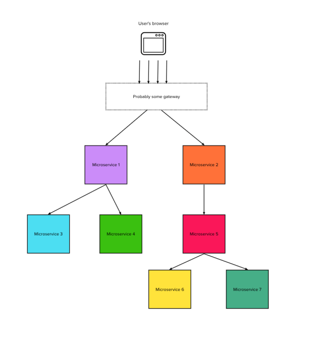
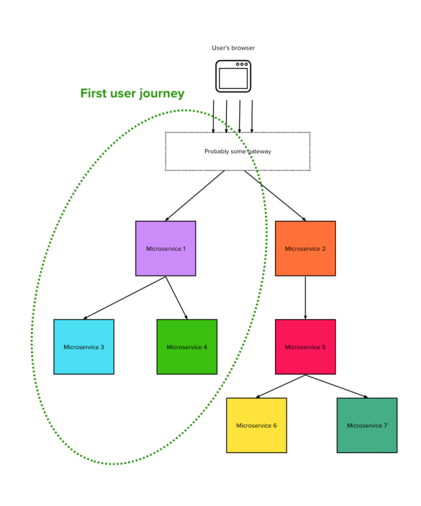
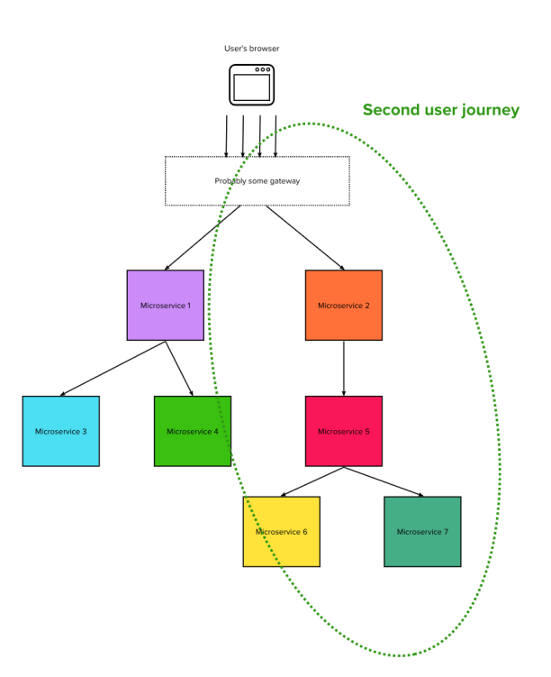
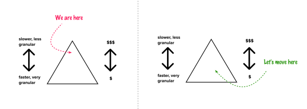
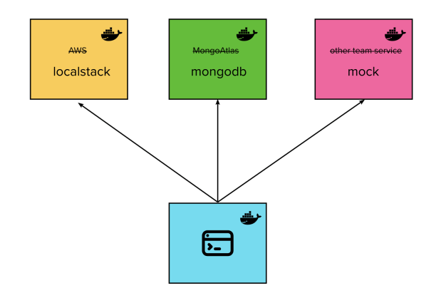
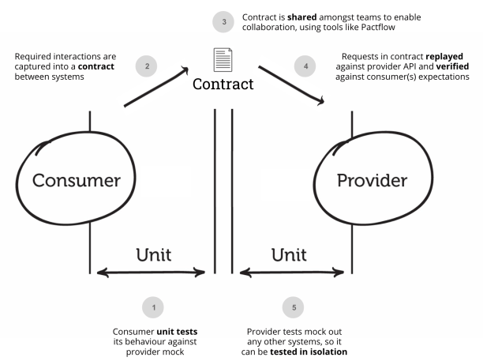
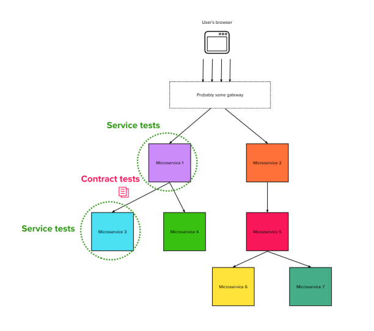

tl;dr They are often broken in pipelines and that might be because they are broken as a concept.

A typical issue in a microservices architecture is ensuring that the integration between services won’t break with the introduction of a new release. In my time as a consultant I have seen different organisations try to tackle this problem with varying degrees of success.

There is one particular approach that I have _never_ seen fully succeed, although it is certainly popular. Organisations often try to have an “integration” test suite in a shared environment that spans several (if not all) services. It usually pokes and prods at functionality owned by multiple teams.

In this article I want to explore why I think these are a bad idea. I will also propose an alternative which is more in line with my understanding of the latest testing good practices.

First, let’s clarify the problem.

## What’s wrong with cross-service integration tests

Let’s imagine a typical company’s architectural diagram when working with a few microservices. There will be some sort of entry point (probably a front-end) talking to different services, and some of those services will in turn call other services to be able to fulfil their requests. In a big-ish company, any given team might own only one or a couple of these components.

A cross-service integration test suite acts upon the entire system (or a big subsection of it) in a shared environment. It runs user journeys by interacting with the entry point as the end users would (often using tools like Cypress or Selenium).

However, behind the scenes, each user journey might require sending requests to quite a broad group of services – which are in turn owned by multiple teams.

On the surface, this testing approach might seem ideal: the entire system is being covered, or at least enough of it to guarantee no regressions on the critical stuff. And all of it from the user’s perspective. It sure sounds great.

However, this shared ownership of the subject under test can create several problems for the teams’ delivery lifecycle and make the test suite extremely fragile (and therefore useless) over time.

These, in my opinion, are the main places where this model goes wrong:

#### **It couples the lifecycle of the services**

One of the main values of microservices is they allow different parts of the overall system to change independently when they are pulled in different directions by business priorities. That is why they are operated by different teams, have different backlogs, different CI/CD pipelines, and live on different machines or containers. Test suites should not be an exception to this rule.

By having a test suite tying them all up together we are not only coupling the releasability of the services it covers, but also the development and QA function of all their teams: they will all have to edit the same suite when making unrelated changes, and they will all be alerted when there is a failure unrelated to what they are working on.

This is reintroducing monolith-like behaviour and team dynamics into our hard earned microservices architecture.

#### It’s prone to flakiness

There can be a lot of complexity behind a single user action from the UI’s (or an API’s) point of view: services calling other services, often in a combination of synchronous and asynchronous models.

You might try to reduce this pain by implementing strategies like retries and timeouts, but when the graph of services to cover is pretty deep then it becomes inevitable for some things to start happening with the wrong timing or in the wrong order. A big organization might also have at least one or two services deploying at any given time, which often leads to short windows of erratic behaviour – especially considering that availability in pre-production is not given the same importance as production.

#### Lack of ownership and accountability

When a team owns a test suite, it is usually an integral part of their product’s CI/CD pipelines. The team maintains it alongside their production code. Indeed, it is often _forced_ to evolve in lock step with the code as the developers will (hopefully) not be able to build their artifacts when their tests are red.

But a cross-service integration test suite is often living far away from any specific services codebase as it has to be across several of them by definition. Therefore it is often owned by a QA team or developed as a collaborative effort by engineers throughout the organization.

As it will most likely sit in some separate pipeline or dashboard that isn’t visible during development, it becomes very easy (and very human) to forget to update it or make code changes without really considering the impact on those tests. Even if there is a QA Team accountable for it, they will still heavily rely on the application teams themselves notifying about new features and making sure they don’t do anything to compromise the tests. So for them having full ownership of it sounds like an impossible task too.

This can cause a lot of random breakages due to features being changed, or code being moved around without updating the tests.

#### Hard to pinpoint the cause of failures

Unclear ownership makes things even more tricky when failures actually happen. Which, in my experience, is pretty often.

Each team has their own independent stream of work to deliver, so many unrelated changes might be released on multiple services in any given day or week. When there is an error in some user journey it can become hard to pinpoint which change might have caused it. This is just due to the sheer scope of the functionality under test: a lot of services have to be checked to find the culprit.

This can cause a lot of slow and annoying back and forth communication when it breaks. No team has a good mental model of how the other’s implementation works (as they shouldn’t), so it becomes all too easy for the debugging to degenerate into a blaming exercise if the company’s culture is less than flawless.

#### There isn’t a good place or moment to run them

There isn’t really a good pipeline which this kind of suite could be blocking. Normal test suites usually belong to a specific product’s pipeline, and a failure is meant to prevent the just pushed code from making it to the next stage (usually a deployment to a greater environment). This is one of the key principles of Continuous Integration. But whose pipeline should this kind of generic suite affect?

If any team were to stop their pipelines based on a failure on the shared suite, very soon you would have them unable from releasing perfectly fine code waiting for someone else on the other side of the organization to fix an unrelated issue. Possibly every day.

So this kind of regression testing usually ends up being scheduled awkwardly outside of product team’s pipelines, running nightly or every few hours – completely independently from deployments. The “broken” version of the code being already deployed in a shared environment means the developers might have moved on to another task, and will have to context switch to fix the tests after the fact.

This also makes it entirely possible for changes which break tests in different ways to pile onto each other and make debugging even more difficult.

#### Overhead in aligning test data

Test data can also make things messy and complicated. Often this type of regression suite needs some seed data to perform its journeys with (think of users and products). This means all teams who somehow own a slice of this data need to align on what to add to their storage by default, even when they might re-deploy it from scratch. All so that they can support the test suite.

In addition, any data generated by the test suite running will need to be cleaned up after the fact. Even when this is automated, there need to be a lot of mechanisms to ensure that no garbage is scattered throughout the system even when the tests fail halfway through.

#### Tests crying wolf

In my experience all of these issues together lead to a collective experience of “oh well, the shared suite is always flaky anyway”, and eye rolls from engineers when it breaks for the umpteenth time.

It becomes very easy for the test results to be dismissed or commented out when management is in a rush to release and they see everything working just fine in pre-production. A dangerous precedent to set.

Worst of all, this can lead to a false sense of security: a suite full of inaccurate/half skipped tests that justifies other, better tests not being written.

## The alternative: Service tests and Contract tests

One might argue that the underlying reason why this type of test has so many problems is that it tries to cover too much ground while being too far up the [Test Pyramid](https://martinfowler.com/bliki/TestPyramid.html). According to the pyramid principle, very granular and detailed tests should sit at the bottom where they are closer to the code and faster to run, with a lot of control over inputs and outputs (e.g. unit tests). On the other end of the spectrum, big expensive tests that cover a lot of systems should sit at the top and be very narrow to avoid flakiness. Clearly, cross-service integration tests sit all the way up at the top in terms of abstraction but they are also very broad in the amount of functionality that they are testing.

The logical solution is to fix our pyramid shape by pushing this type of coverage down a few layers: back into the individual microservices themselves.

Integration test suites are usually covering two important characteristics: that the services are functionally complete (all the features are supported), and that the integration between them is sound. We need to take them both into account if we want to keep the same level of confidence in our automation while refactoring it.

Fortunately, there are other types of tests sitting a bit lower in the pyramid that can help us: I propose to split our previous coverage into its two fundamental building blocks: using **service tests** to cover the functionality itself, and **contract tests** to ensure the integration.

### Service tests

A type of test that allows us to verify functionality at a high enough level of abstraction (without returning all the way down to unit tests) is **service tests**, sometimes also called **[component tests](https://martinfowler.com/bliki/ComponentTest.html)**.

> A component test is a test that limits the scope of the exercised software to a portion of the system under test. It is in contrast to a [BroadStackTest](https://martinfowler.com/bliki/BroadStackTest.html) that’s intended to exercise as much of the system as is reasonable.
> 
> From [https://martinfowler.com/bliki/ComponentTest.html](https://martinfowler.com/bliki/ComponentTest.html)

In other words, service or component tests will only run the journeys relevant to a single service, using test doubles for any other service that it invokes.

For example, the service under test might be isolated by mocking all of its dependencies with Docker containers. Luckily, [someone has written an article on how to do just that](/blog/an-isolated-developer-setup-with-docker/) 🙂

There are several advantages to using this type of test over broader range ones:

-   They are much faster and cheaper to run
-   They will never break if downstream services are temporarily down, or another team makes a mistake: only a true regression in the service under test will cause a failure
-   They offer more control over responses given by downstream services, allowing us to mock them – therefore being able to write comprehensive tests for “unhappy paths” too
-   They have a clear place in the product team’s own delivery pipelines, so they can actually be set to prevent broken changes from making it to higher environments
-   They are written by the people closest to the context of the service, who can integrate their maintenance into their day to day code writing

All of these benefits are great. But clearly no integration is being tested here just by writing mocks: if our assumptions on how the neighbouring services work are wrong or outdated, then the mocks will be wrong too and the integration will fall apart in production.

That is why I suggest to use this type of test in combination with another type.

### Contract tests

Contract tests are an excellent way of avoiding accidentally testing the **functionality** of services when what we actually want to test is the **integration** between them. They allow us to logically group services into consumers and providers, and only verify their integration (or contract). The contract should be driven by the consumer team, respecting the principles of [Consumer Driven Contracts](https://martinfowler.com/articles/consumerDrivenContracts.html).

Image stolen from Pact documentation

It is out of the scope of this article to explain in-depth how contract tests can be implemented, but here is a summary:

> The consuming team writes automated tests with all consumer expectations
> 
> They publish the tests for the providing team
> 
> The providing team runs the CDC tests continuously and keeps them green
> 
> Both teams talk to each other once the CDC tests break
> 
> From [https://martinfowler.com/articles/practical-test-pyramid.html#ContractTests](https://martinfowler.com/articles/practical-test-pyramid.html#ContractTests)

The way the tests can be actually run by the producers or exposed by the consumers can be an ad-hoc implementation, or maybe some fancy tool like [Pact](https://docs.pact.io/).

Regardless of implementation choices, contract tests have the following benefits over cross-service integration suites:

-   They allow us to zoom into the integration between services, specifying the messaging format in much greater detail than a generic integration test
-   They allow us to specify the contract of all sorts of error scenarios too, which might otherwise be missed when the requests are played between real deployed services
-   Like service tests, they too will belong in a specific team’s pipeline (the producer’s) and prevent them from deploying new versions which would break the integration if promoted further
-   Having contract tests forces you to think more deeply about your APIs, and consequently what should be the optimal division of responsibilities between your services – forcing teams to provide better encapsulated functionality

### Putting it all together

The combination of service and contract tests allows us to avoid testing the whole “graph” of microservices, instead just testing individual nodes and edges separately (but covering the whole system nonetheless).

Using this method, we can either reduce our end-to-end/integration suites to very few high level sanity checks (maybe more resembling of smoke tests) just to check the various infrastructure bits are still talking to each other, or remove them altogether.

In my experience, this approach of having tests lower down the pyramid is way less brittle and leads to happier, more autonomous development teams without compromising the safety of releases. Indeed, I have actually seen it make releases even safer by virtue of the test suites being allowed to get into way more of the nitty-gritty details and generally being better looked after.

## Is there no space for integration tests at all?

Here comes the time for nuance. Ironically, as I write this article I am also working on creating the very thing I am discouraging. A cross-service integration test suite. (The horror). There are a few reasons why, most of them being about the system being a big old legacy thing with barely any automated tests at all.

I think this makes for a pretty good use case for such a test suite: when dealing with little known systems with no automation we have to treat them like a black box for a while if we hope to introduce any refactoring, or reduce manual testing. This means we might need to introduce coverage from the outside, with no time for nuances such as which network calls happen between all of their sub-components.

Another scenario in which I can imagine this type of test working well is during the splitting phase of a monolith, as the service boundaries are still wobbly and cannot be exactly frozen into contracts just yet.

Still, once microservices have been stabilized (or modernized), it makes sense to keep service and contract tests as a sensible end goal for the system over a big God-like test suite. If you already have one, or used it as an intermediate step, this can happen in stages with test cases getting pushed down one at a time.

In conclusion, I think cross-service integration tests can be at best useful as a stepping stone for more modern setups, but at worst they can paralyze entire groups of engineers or even organizations. In short, they have to go.
