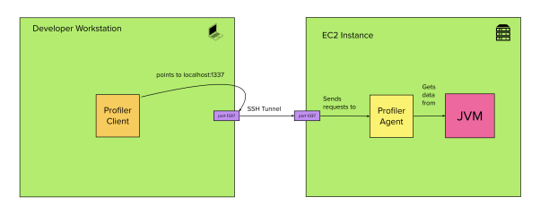
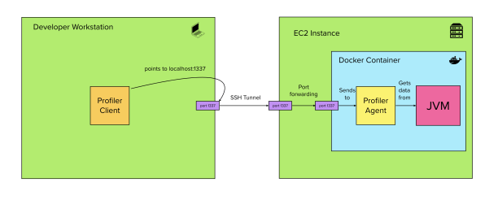
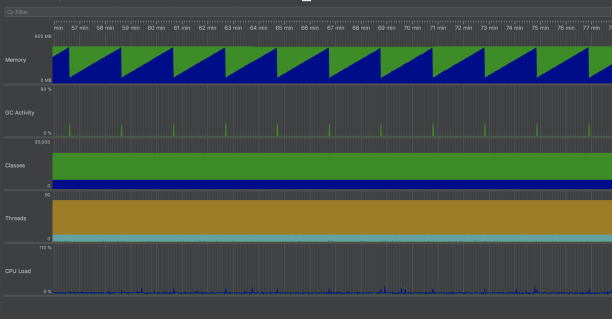

Part of running big distributed systems at scale is encountering issues which are hard to debug. Memory leaks, sudden crashes, threads hanging… they might all manifest under extreme production conditions, but never on our laptops or test environments.

That’s why sometimes we might need to go straight to the source and profile a single JVM under real production load.

This guide aims to show how we can attach a profiler to a running application when the network, AWS permissions or even a layer of containerisation might be in the way.



We will achieve this by making use of a profiler agent running next to the remote JVM, which will send data to our profiler client. The two will be connected by an SSH tunnel.

### Installing the profiler client locally

For the purposes of this guide we will be using [JProfiler](https://www.ej-technologies.com/products/jprofiler/overview.html), although any profiler that works with an agent and a client can be used by following the same principles.

Here is the download link for the JProfiler client: [https://www.ej-technologies.com/download/jprofiler/files](https://www.ej-technologies.com/download/jprofiler/files)

### Installing and attaching the profiler agent on the running instance (no Docker)

Connect to your running instance with SSH or SSM Session Manager.  
The first thing you will need to do is download the profiler agent onto it.  
For JProfiler, you can run:

```shell
$ wget -O /tmp/jprofiler_linux_12_0.tar.gz https://download-gcdn.ej-technologies.com/jprofiler/jprofiler_linux_12_0.tar.gz
```

The tar file then needs to be extracted:

```shell
$ tar -xzf /tmp/jprofiler_linux_12_0.tar.gz -C /usr/local
```

And it can be attached to the already running JVM by invoking the agent with:

```shell
$ /usr/local/jprofiler12.0/bin/jpenable -g -p 1337
```

Where 1337 is the port I want the profiler agent to use in this example.

### Installing and attaching the profiler agent on the running instance (with Docker)

Things get a little more complicated with Docker in the middle, as the profiler agent will need to be installed into the container, and we need to forward the profiler traffic arriving at the host.



**Setting up the port forwarding**

Unfortunately, our application container might need to be started with the port forwarding already in place.  
This means that if you cannot afford to restart the container on the production instance directly, your deployment setup will likely have to change.

You can forward the profiler port by adding the option `-p 1337:1337` on the `docker run` command that you use to start your application container, or the equivalent option in your `docker-compose` file.

**Setting up the agent**

Now that the traffic will be forwarded from the host to the container, we can work on setting up the agent on the same port. To do so, we can connect to the EC2 instance and download the agent onto it as in the previous step, by running:

```shell
$ wget -O /tmp/jprofiler_linux_12_0.tar.gz https://download-gcdn.ej-technologies.com/jprofiler/jprofiler_linux_12_0.tar.gz
```

But then we will need to copy the agent file into the container with the `docker cp` command:

```shell
$ docker cp /tmp/jprofiler_linux_12_0.tar.gz <container-name>:/tmp/
```

Extract it in the container (as root) with `docker exec`:

```shell
$ docker exec -u 0 <container-name> /bin/bash -c 'tar -xzf /tmp/jprofiler_linux_12_0.tar.gz -C /usr/local'
```

And run it (as the user that owns the JVM):

```shell
$ docker exec -u <jvm-owner-user-id> <container-name> /bin/bash -c '/usr/local/jprofiler12.0/bin/jpenable -g -p 1337'
```

Where 1337 is the port I want the profiler agent to use in this example.

Now we should have a setup where any traffic arriving at port 1337 on the host will be forwarded to the profiler agent.

### Setting up the SSH Tunnel

The last step is to connect the profiler client and profiler agent over the network.

We can use the [SSH local port forwarding feature](/blog/ssh-tunnelling-and-port-forwarding/) for this purpose, and create a tunnel between our machine’s port 1337 and the EC2 instance’s port 1337.

We can achieve this by running the following command locally:

```shell
$ ssh -i <path-to-your-instance-key> -L 1337:localhost:1337 <user>@$<instance-ip-or-dns-name>
```

#### No SSH access to the EC2 instance? No problem.

Sometimes we don’t have a key pair for a particular instance, or we don’t have the necessary network configuration to reach it over SSH, or we don’t have the right port open. That’s fine.

In order to bypass that limitation and still obtain a tunnel we can make use of the [ProxyCommand feature of SSH](/blog/jumping-ssh-hosts/) and send our traffic through an SSM command run with the AWS CLI.

This will leverage the AWS API and existing IAM permissions to authenticate us.

```shell
$ ssh  -L 1337:localhost:1337 <user>@$<instance-ip-or-dns-name> -o ProxyCommand="sh -c \"aws ssm start-session --target %h --document-name AWS-StartSSHSession --parameters 'portNumber=%p'\""
```

Make sure that you have all of the necessary AWS CLI environment variables or profiles for authenticating yourself (and the permissions to issue the command).

More info on the [AWS Documentation](https://docs.aws.amazon.com/systems-manager/latest/userguide/session-manager-getting-started-enable-ssh-connections.html)

### Connecting the Client

If everything went well, we should now be able to start the JProfiler client on our local machine. We need to set up the client to connect to a JVM “on another computer”. We will be connecting to “localhost” or 127.0.0.1, and according to our example the profiling port will be 1337.

After you’ve selected all your favourite options, if you start seeing some output like the following



then it means everything has worked, and you can finally start poking around your heap, threads and whatnot.
