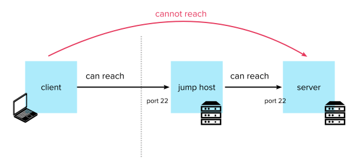
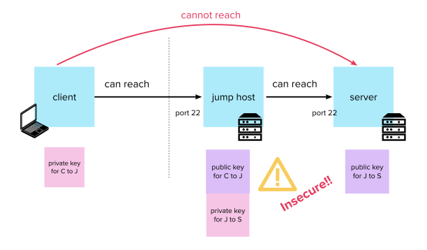
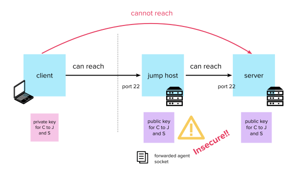
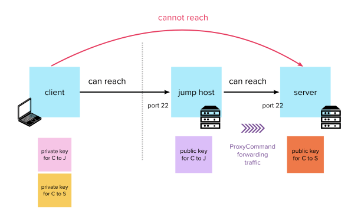

Sometimes servers are unreachable to us due to network topology barriers, which are put in place for security reasons.

A common way to allow developers and sysadmins access is to provide public “bastion” or jump hosts, where one can obtain a shell and then use it to connect to one’s destination.



Looking at the picture above, things may seem pretty simple – but how is authentication handled when more than two parties are involved in a connection?

Let’s explore the anti-patterns first, and then move on to the proper way of doing things.

#### Storing an intermediate key pair



In this solution, two key pairs are created: the first for accessing the jump host from the client, and the second for accessing the server from the jump host, as in the picture above.

We SSH into the jump host using the first key pair to get a shell, and from there SSH into the server using the second.

However, this involves installing a private key onto a middle (potentially public) system, which is not always desirable. An intruder who compromises the jump host might be able to read the private key there, and use it to access the remote server or any number of machines in the private network.

#### Forwarding SSH agent



A slightly better, but still potentially dangerous, solution involves the helper command we met in the [SSH Agent](/blog/ssh-agent/) post: `ssh-agent`.

With the special `-A` flag to the ssh command, we are able to “forward” the local `ssh-agent` containing our keys to the jump host. This allows us to re-use our agent from there (and all the keys we added to it) as if we were on our own machine.  
This way we can re-use our private keys but without storing any of them on the jump host.

To set up a simple authentication based on ssh-agent forwarding we might want to install our public key in both the jump host’s and the remote server’s `authorized_keys` files, as in the picture.  
Then we can add our private key to our local agent like this:

```shell
$ ssh-add ~/.ssh/key_name_id_rsa
```

And forward it when connecting to the jump host:

```shell
$ ssh -A myuser@jump-host
```

From within the jump host, we should be able to keep using any key previously added to our agent, so we are able to SSH normally into the final remote server:

```shell
$ ssh myuser@myserver
```

##### _How could it be insecure?_

The `ssh-agent` is a process which stores our keys unencrypted in memory and communicates through a Unix socket (see the [SSH Agent](/blog/ssh-agent/) post to understand why). As mentioned, SSH knows where to find the agent socket by looking at the variable `$SSH_AUTH_SOCK`.

When SSH connects with the agent forwarding option `-A` enabled, it tells the SSH daemon on the jump host to set its own `$SSH_AUTH_SOCK` variable to a newly created socket. That socket is made to actually point back over the network to the one in our local machine (the communication is routed through a secondary channel).

That way when the SSH client on the jump host wants to connect to the agent, it will be unknowingly communicating with the agent on our local machine instead of its own.

Usually the socket file on the jump host is stored in `/tmp` and only the user who owns the SSH session can use it.

```shell
$ sudo find /tmp -path '*ssh*' -type s
/tmp/ssh-JVEaf5qUm5O1/agent.57796
```

However, the root user has access to _everything_.  
Therefore, any other user gaining access to the jump host as root could simply set their own `$SSH_AUTH_SOCK` to point to our socket, and use our `ssh-agent` as their own.

```shell
$ SSH_AUTH_SOCK=/tmp/ssh-JVEaf5qUm5O1/agent.57796 ssh myuser@myserver
```

That’s why it’s very important to only forward our SSH agent to servers that we fully trust.

#### ProxyCommand and ProxyJump

Unlike agent forwarding and the intermediate key pair, this method does not store or otherwise expose our keys on the bastion.



The SSH client connects to the jump host first, then executes a `ProxyCommand` which forwards the standard input and output to the remote server:

```shell
$ ssh -i ~/.ssh/server_id_rsa -oProxyCommand="ssh -i ~/.ssh/jump_id_rsa jump-host nc myserver" myserver
```

_This command looks very long and convoluted. It will get simpler. It is worth doing things the “old-fashioned” way first in order to understand all of the underlying components._

It is essentially structured into two _SSH_ commands, connected by the `-oProxyCommand` directive:

-   The “inner” SSH command passed to the `-oProxyCommand` option (within the double quotes) connects to the jump host.  
    Once connected, it starts a netcat (`nc`) process on the jump host which carries all its stdin to the server, and all the stdout back. This allows us to run…
-   The “outer” SSH (outside the double quotes), which connects to the server.  
    However, instead of connecting the usual way, the `-oProxyCommand` flag tells it that when it tries to establish a connection to `server` it should do so using the stdin/stdout of the “inner” command as a transport. That will be the stdin and stdout of the netcat process we started on the jump host, which will be routed directly to the server.

The combination of the two allows you to obtain a shell directly into the server, using the jump host as a proxy.  
You will need to provide authentication in the form of a private key or password to both commands, as in the example.

In later versions of SSH, you can avoid using netcat (which is handy as it might not be installed on your jump host) and instead use the equivalent flag `-W` in the inner command:

```shell
$ ssh -i ~/.ssh/server_id_rsa -oProxyCommand="ssh -i ~/.ssh/jump_id_rsa jump-host -W myserver" myserver
```

And you can use “special string substitutions” inside the inner command to avoid repeating the final host and port:

```shell
$ ssh -i ~/.ssh/server_id_rsa -oProxyCommand="ssh -i ~/.ssh/jump_id_rsa jump-host -W %h:%p" myserver
```

`ProxyCommand` can also be specified in the `~/.ssh/config` file instead of the command line for simplicity:

```
Host server
   ProxyCommand "ssh -i ~/.ssh/jump_id_rsa jump-host -W %h:%p"
   HostName myserver
   User myusername
   Port 1337
   IdentityFile ~/ssh/my_key_for_the_server
```

##### A shortcut: -J, or ProxyJump

Luckily, we don’t have to do all that anymore. Later versions of SSH (OpenSSH 7.3) now simplify this common use case with `ProxyJump`, or the command line flag `-J`:

```shell
$ ssh -J username@jump-host username@server
```

> Connect to the target host by first making a `ssh` connection to the jump host described by destination and then establishing a TCP forwarding to the ultimate destination from there.
> 
> ssh [man page](https://man.openbsd.org/ssh_config.5)

A little drawback: since there is no separation of “inner” and “outer” commands anymore, there would be ambiguity if the user were allowed to specify options (like the private key) for the jump host as well as for the server in the same command.  
Therefore we have to put any required configuration for the jump host into our `~/.ssh/config` instead:

```
Host jump
   HostName jump-host
   User myusername
   Port 1337
   IdentityFile ~/ssh/my_key_for_the_jump_host_id_rsa
```

Once this is done, the simplified version of the command will immediately give us a shell into our destination, securely routing all the traffic through the jump host.

You can even route the traffic through more than one server in case you have multiple levels of separation in the network between a bastion and the final remote host.   
All you need to do is specify comma-separated jump hosts to `-J`:

```shell
$ ssh -J username@jump-host1,username@jump-host2 username@server
```

It is possible to specify the jumps you want to make in `~/.ssh/config` with the equivalent option `ProxyJump`:

```
Host server
   ProxyJump jump
   HostName myserver
   User myusername
   Port 1337
   IdentityFile ~/ssh/my_key_for_the_server

Host jump
   HostName jump-host
   User myusername
   Port 1337
   IdentityFile ~/ssh/my_key_for_the_jump_host_id_rsa
```

Much clearer than its `ProxyCommand` equivalent.

##### Is ProxyCommand dead?

While the newer options are far simpler, they are only a shorthand for the most common use case. ProxyCommand still has a place in non-standard scenarios.

You might want to use a more elaborate command than just the simple TCP forwarding/netcat equivalent provided by `-J`.

For example, from the documentation:

> This directive is useful in conjunction with [nc(1)](http://man.openbsd.org/nc.1) and its proxy support. For example, the following directive would connect via an HTTP proxy at 192.0.2.0:

```
ProxyCommand /usr/bin/nc -X connect -x 192.0.2.0:8080 %h %p
```

As another example, Amazon offers the SSM service to connect to its EC2 machines these days, discouraging opening them up for SSH connections from the world. With a `ProxyCommand` trick, it is possible to still set up an SSH connection to them:

```shell
$ ssh -oProxyCommand="sh -c \"aws ssm start-session --target %h --document-name AWS-StartSSHSession --parameters 'portNumber=%p'\"" myuser@myec2instance
```

The `ProxyCommand` option is used to invoke `aws ssm start-session` to establish a connection to your target EC2, rather than connecting directly over port 22. The AWS CLI is making API calls over HTTPS, so you only need port 443 open locally; and those calls are secured by IAM authentication and policies.

More info on the [AWS documentation](https://docs.aws.amazon.com/systems-manager/latest/userguide/session-manager-getting-started-enable-ssh-connections.html)  

### [Next: Tunnelling and Port Forwarding →](/blog/ssh-tunnelling-and-port-forwarding/)

#### [← Previous: Config](/blog/ssh-config/)

### Table of Contents:

1.  [Introduction](/blog/ssh-for-developers-beyond-the-basics-series/)
2.  [Authentication](/blog/ssh-authentication-methods/)
3.  [Known Hosts](/blog/ssh-known-hosts/)
4.  [SSH Agent](/blog/ssh-agent/)
5.  [Config](/blog/ssh-config/)
6.  [Jumping Hosts](/blog/jumping-ssh-hosts/)
7.  [Tunnelling and Port Forwarding](/blog/ssh-tunnelling-and-port-forwarding/)
8.  [X11 Forwarding](/blog/ssh-x11-forwarding/)
9.  [Multiplexing and Master Mode](/blog/ssh-multiplexing-and-master-mode/)
