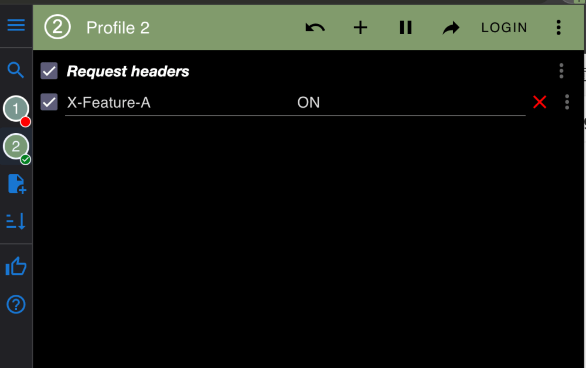
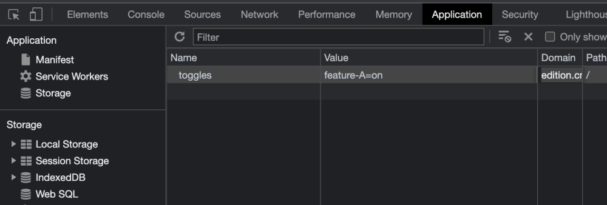
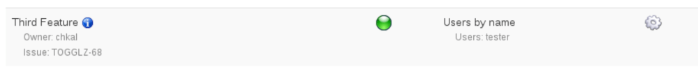
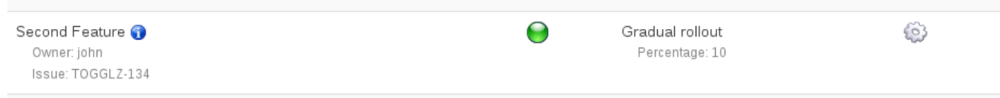
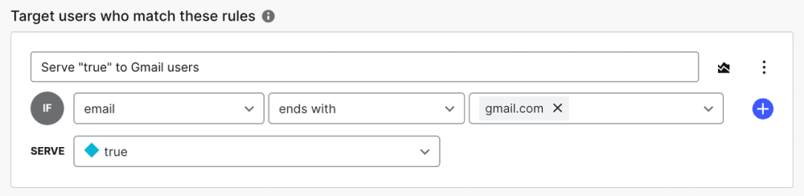

In this article, I want to challenge where software testing happens and suggest that most manual verification (desk checks, QA, demo) that is part of a team’s delivery lifecycle should happen in production itself, rather than in some staging or UAT environment.

I have used this approach in several teams within medium to large organisations that were already implementing Continuous Delivery and/or Deployment, as it became the obvious and natural next step in our workflow.

#### **Is it safe?**

Let’s address the elephant in the room already: yes, performing your QA in production sounds like an oxymoron. After all, isn’t the purpose of QA to prevent broken features from being deployed to production in the first place?

This might have been true in the past. However, since then, a new practice has changed the way we release new features: **Feature Toggles**.

> _The basic idea is to have a configuration file that defines a bunch of toggles for various features you have pending. The running application then uses these toggles in order to decide whether or not to show the new feature._
> 
> Martin Fowler

You can read more in depth about Feature toggles and their different flavours in [this excellent article by Pete Hodgson](https://martinfowler.com/articles/feature-toggles.html), but the key takeaway is that this practice has enabled teams performing Continuous Delivery (or even Continuous Deployment) to **decouple the concept of deploying code from releasing features**. Teams following the values of CD are now able to perform deployments much more frequently, even when their features aren’t necessarily in a releasable state yet. Then, with the flick of a runtime switch, their work can be live to the users without any new deployment needed.

Not to mention, high level automated tests have also evolved to a point of sophistication where we can be confident that regressions will be caught by pipelines way before the code gets rolled out.

The combination of these practices means that rolling out manually un-verified code to production has not only become safe with CD: it has become **routine**. Existing live functionality is covered by high level automated tests in earlier environments, while unreleased features are hidden behind a toggle (and have automated tests of their own). Nothing broken gets exposed to the users.

#### **Another step forward**

With the advancement of feature toggle mechanisms and frameworks (which we will explore later on), it has also become possible for a feature to be visible for a chosen subset of users. They would override the toggle state for themselves only, while keeping the feature hidden to everyone else. This can enable a few selected stakeholders to try out the functionality in their own browser session before actually releasing it.

I want to argue that this capability is not just another one of many fancy framework features: it’s actually the key to unlock a different way of looking at the QA function that wasn’t possible before, and by extension change the entire team’s way of delivering software.

It can be leveraged by QAs and POs to check if their team’s work matches the specification directly in production – rather than in pre-production. Following this principle, code changes related to every user story should be fully rolled out, and “works in production under toggle” can be included in the developer Definition of Done. After the manual QA, using the same toggles with canary release and A/B testing configurations can be the logical next step to go live.

What I observed working for many of our clients is that, despite all the feature toggle capabilities, many teams are still wary of touching production and they will still look at their features only in some UAT, staging or development environment before declaring them “complete”. The concept of “production” is still treated with reverence and a bit of fear: largely only touched for releasing. I would say that not only this mindset belongs in the past, where deployments were sketchy and happened once in a full moon, but it can actually represent a big missed opportunity to deliver software more safely and make our team happier.

Let’s talk about why in the next section.

## **Why test in production?**

“Today we can and yesterday we couldn’t” is hardly a good enough reason to do anything. And so far, we only talked about the fact that it’s possible, not yet about why we should bother. So here I want to go deeper into why investing effort into advanced feature toggle setups and a bit of cultural change is a good idea. 

Below is a list of seven concrete benefits we found and some considerations we kept in mind.

### 1\. **If it works in production, it works period**

As hard as we try to achieve “dev-production” parity, the two will never be identical. Here are just a few examples of things that likely will differ even in a near-perfect staging environment:

-   **Application configuration**: URLs of external systems, thread pool sizes, server settings, sometimes authentication settings…
-   **Network configuration**: anything in pre-production will likely be accessible only from within the organisation, making the network set up look very different. CDN or proxy services like Cloudflare or Akamai might be absent or set up differently. Additional rules for outbound requests might also apply.
-   **Amount and size of machines or containers**: pre-production environments will likely be smaller on account of low traffic and our stakeholders not wanting to double their cloud provider bills. This means machines might have less resources like memory and CPU and there might be fewer of them under load balancing, making it impossible to know whether our code can scale
-   **Inbound traffic and load patterns:** pre-production machines won’t receive nearly any traffic, potentially hiding performance issues with new code, memory leaks, or any other type of resource exhaustion
-   **Active connections to external systems**: amount of open sockets, connection pools size and usage… all of these might cause problems only when the application only is faced with some realistic traffic
-   **Data volume:** the size of databases and queues won’t be comparable as they might only have just some sample data used for manual testing. Non-performant queries or updates might only be visible with a realistic, much bigger data set
-   **Data itself:** real, user-generated data is often well outside of what we can predict when we think of the feature’s happy path. If a user can break it, they will. This might cause unforeseen bugs to features that seemed to work fine with only the test data we had in our pre-production.
-   **Integration with other team’s services:** we don’t usually have many guarantees about how other teams’ pre-production environments are managed: how similarly they are configured to the real thing, what data they have in them and whether their actual deployed version is the one that is live at the moment
-   **Integrations with third party systems:** if we have little guarantees about other teams’ test environments, we have even less with vendors – with the additional high communication overhead (organisational politics) to figure out if they will behave similarly to production

All of these variables might cause a feature that appears to work just fine in another environment to actually have unforeseen bugs and behaviours when released. They can manifest both as functional issues with the feature (a certain request doesn’t work because the contract in production is different, production database doesn’t have values for some data because of historical reasons we forgot to handle…) but also as scaling and load problems.

However, if a feature is proven to work in production for one user, teams can be near 100% sure that it will be functionally fine for all other users. After that, canary releases and A/B testing bridge the rest of the gap to ensure it can also work at scale.

### 2\. **Less fear of releases**

The social aspect of being more confident in your releases is not to be underestimated. A team whose stakeholders have already seen proof a feature works in production is less fearful to send it live for everyone else. This can lead to more frequent (therefore less risky) releases, improving time to market and the team’s ability to respond to change.

### 3\. **Manual testing is expensive**

Given how expensive and precious manual testing is, we try to avoid repeating it as much as possible. That’s why it should be performed in the environment that is least likely to yield false positives: the one closest to the real thing. Which in this case _is_ the real thing.

### 4\. **No more tasks bouncing between “done” and “development”**

Having a cleaner board and more straightforward development life cycle is another happy side effect of being more confident in the completeness of your features. Developers can pick up new tasks after a desk check, without wondering whether they will be interrupted by some re-work needed later on. This limits their WIP and allows them to keep focus on the task at hand.

### 5\. **Developer ownership of the full path to production**

Including “works in production under toggle” into the Definition of Done for user stories allows developers to be responsible for the code they build all the way through. No more throwing tasks “over the wall” for someone else to test, with context getting lost in the process and bugs slipping through the cracks. This also enables cross-functional teams where dev and QA roles can work collaboratively, rather than in silos.

### 6\. **Better security hygiene**

Last but not least, wanting to have the “perfect” staging environment sometimes leads teams to – either by accident or on purpose – copy production data or traffic into their pre-production infrastructure. Even when this data can be somehow anonymised, this is a very risky practice and can lead to some serious incidents or accidental non-compliance with regulations like GDPR. We can avoid this by having another way to prove features won’t break once faced with real user data: seeing if they fail where the real user data lives in the first place.

### 7\. **It’s cheaper**

A widely adopted practice by teams wanting to make sure their features are sound performance-wise is load testing in pre-production. Besides this probably being inaccurate due to load patterns not matching the real thing, it can also get very expensive very quickly if done often, due to having to scale up resources. We can reduce the need for load testing (and also our AWS bills) by verifying our new features respond well to traffic with canary releases instead.

## **How to test in production?**

Now that we have discussed why this practice might be a good idea, let’s dive deeper into the technical means that make it all possible. In this section we will consider different feature toggle scenarios and how to deal with test data.

### **Advanced feature toggles**

There are a number of pretty advanced self-contained feature toggle frameworks like [Togglz](https://www.togglz.org/) you can find out there for all the major application stacks. Or you might invest in an external feature toggle server that multiple services can use, like [Unleash](https://www.getunleash.io/). And some companies like [LaunchDarkly](https://launchdarkly.com/) even offer this as a service if you are too lazy to install or build anything.

For the purposes of this article, I am going to showcase some examples of common feature toggle feature mechanisms and what part they can play in the final stages of our path to going live.

#### **1\. Toggle on for manual testing**

Manually verifying a feature works as intended should be the first step before deciding to release, and it should be routinely done for every user story we build. In order to do this, we must guarantee that only an intended handful of users have access to it. In other words, the feature toggle should have a status of “ON” for ourselves and probably our PO and stakeholders, and “OFF” for everyone else. There are several ways we can achieve this:

##### **BY HEADER**

Some feature toggle mechanisms offer overriding the toggle state based on the HTTP request having a certain header. You can install extensions like [ModHeaders](https://chrome.google.com/webstore/detail/modheader/idgpnmonknjnojddfkpgkljpfnnfcklj?hl=en) to make sure your browser is sending it.

If your application is not browser based, you can edit headers very easily with tools like Postman or curl. This approach works well with APIs and other HTTP based applications.

##### **BY COOKIE**

You can also leverage cookies for the same purpose. Your framework might allow overriding a toggle only when a certain cookie is present, which can be edited directly from most browsers.

This works best with browser based applications. However some care must be taken to remember that cookies will be persisted across website visits.

##### **BY APPLICATION USER**

Some frameworks also can be connected to your application’s user repository. If you invest in setting up that configuration, you will be able to use your application’s concept of what a “user” is to enable toggles only for some of them, by whatever identifier you decide to use. Your stakeholders can register as an application user and will be able to test features by whitelisting their identifier. Example with Togglz:

#### **2\. Perform a canary release**

Manual testing with a single user is great, but it doesn’t do much to prove that the new feature will behave well under load, or that it will not generate errors when processing data from other users. That’s why it can be useful to perform a canary release with a significant subset of your traffic once your feature is pretty close to being rolled out, and closely monitor your dashboards for errors and effects on performance. 

This part is usually left out of the Definition of Done for a single task, and can be performed later:  once there is enough built to run a pilot of the entire feature.

##### **BY TRAFFIC PERCENTAGE**

By far the most straightforward way to perform a canary release is by selecting the percentage of traffic you want to expose your feature to, and then gradually increasing that when you want to go fully live. Example from Togglz:

Users will be assigned to see the new feature randomly, so while this is very simple it also assumes that all of your traffic is of equal risk and importance.

##### **BY USER ATTRIBUTES**

If relevant to your feature, you might want to target a specific subset of your users based on some rule or group they belong to, for example if some types of users are more critical or more affected than others. Example from LaunchDarkly:

##### **BY GEOLOCATION**

An important use case of rolling out by different groups of users is the ability to do so based on their region, which can be implemented as a custom toggle strategy in many frameworks. This is especially relevant if your company serves multiple markets in different countries, some of which are secondary and can be used as a pilot without too much risk involved.

#### **3\. A/B testing**

Testing doesn’t just have to prove that a feature _technically_ works. Even with flawless execution of the acceptance criteria and great technical performance, it might not be the right feature at all, and end up making users unhappy.

Feature toggle frameworks are at their most powerful when they can be extended and linked to analytics tools in order to perform meaningful A/B tests over business metrics like click throughs and conversions, not just technical metrics.

This capability can be built by configuring a toggle so that it runs for a specified amount of time (one or two weeks) with an “control” group not seeing the new feature, and a “test” group where the feature is active. This can be configured with a 50/50 split or a lower percentage for the test group depending on the risk. The toggle leaves a trace of which group each user belonged to during their session, which can get collected by the analytics later. This is also offered out of the box by tools like [Optimizely](https://www.optimizely.com/).

The data collected this way will be unaffected by market changes or external factors (e.g. is it Black Friday week? Some other feature changed a week ago?), as both groups are active at the same time.

Having A/B testing capabilities allows us to easily close the feedback loop and make sure the team is delivering the right features, letting the same toggles truly support us from the very beginning of the build stage well into the feature being live and measured for business performance.

## **Flags for test data**

Testing in production and toggling by request is great, but some features cannot be tested only at the request level: they might impact the state of the application, and data that all users end up seeing.

That’s why some organisations actually go one step further and flag some of their data stored in production as “test only”, especially common entities such as products, users, orders etc.

In this setup, that data is displayed and accessible only to a few people for manual testing purposes, and stays hidden from everyone else. The display mechanism can either be a feature toggle itself or leverage similar mechanisms to feature toggle activation. It becomes very important for handling of test data to be considered when building new features in order to not accidentally expose it or create unforeseen bugs.

This works well in my experience, but can become a very laborious setup as multiple teams need to agree on how to treat test data, and it needs some development effort since it is very application dependent.

## **What can we not test in production?**

Does all of this mean we should tear down any pre-prod infrastructure because it has now become a redundant money pit? Probably not. At least, not yet. There are still some things you should probably avoid testing directly in production, mostly because they are hard to cover with decent regression tests or it is just highly impractical to do. Even with the most advanced feature toggle and test data setup, there are still a few categories of changes where not even having a look in pre-prod might make people feel rightfully uneasy:

-   Writing data to third party systems with serious side effects
-   Anything to do with payments
-   Infrastructure and networking changes
-   Any feature which significantly changes the shape of data

And probably more.

All of these make a good case for not throwing away our other environments just yet, and still consider pausing our pipelines in staging for manual verification once in a while.

However, the industry is getting more and more mature and finding ways to make these changes safer and incremental. My hope is that as the testing culture becomes more solid around them we will diminish the need of obstructing the continuous flow of deployments even more – and we will finally decouple our technical means of publishing code to environments from the way our businesses verify and ship value to their customers.
