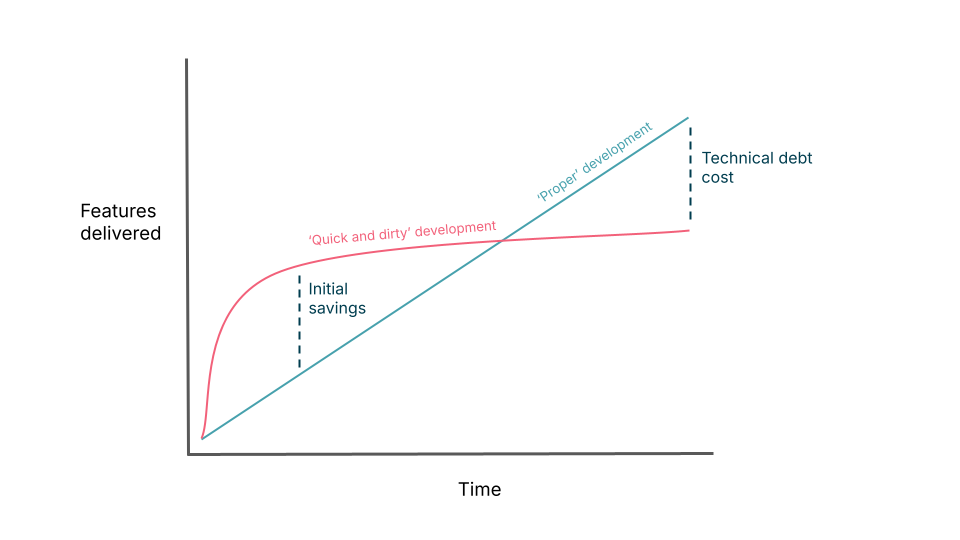

Note: this article was originally published [on the Thoughtworks blog](https://www.thoughtworks.com/insights/blog/programming-languages/should-still-design-code-humans).

A few weeks ago I attended the [Future of Software Engineering event](https://www.thoughtworks.com/about-us/events/the-future-of-software-development-europe-2026) in Engelberg, Switzerland. As you might expect from an event that happened in the middle of 2026, many conversations revolved around AI engineering practices and coding agents. 

I encountered a range of points of view at the event. Some spoke about preferring to keep agents on a tight leash, reviewing their output line by line to make sure it’s maintainable, well-partitioned and everything else we’ve come to associate with good [software craftsmanship](https://www.thoughtworks.com/insights/blog/agile-engineering-practices/why-ai-raising-stakes-software-engineering-craft).

Others claimed they'd rather delegate the majority of the software development lifecycle to agents. This group, broadly speaking, weren’t particularly bothered about the code agents actually produce; for them, time is better spent improving the specs and deterministic checks that guide the agent, leaving the agent to take care of the code completely. (As long as the build stays green, of course.)

## Will humans never need to look at code again?

The ‘full autonomy’ end of the spectrum is what gives me the most pause. It reminded me of a bigger idea that I frequently see circulating in my social circles and media feeds:

_Soon, no humans will ever look at or maintain code again. Will good software design\* even matter a few years from now?_

This argument goes something like this: as agentic workflows evolve, eventually all humans will have to produce is markdown specs, or context trees, or whatever new interaction pattern will be popular a few months from now. This specification can then be thrown over the fence at a team of AI agents who will generate, test, review, deploy and later evolve the code. Eventually, code might become little more than an implementation detail to most companies; we may even be able to have agents on-call, responding to production incidents at 2am. 

Some flavors of [spec-driven development](https://martinfowler.com/articles/exploring-gen-ai/sdd-3-tools.html) already advocate for treating specs as the new lingua franca of software development, and the code as an ephemeral artifact.

The second line of the [Agile Manifesto](https://agilemanifesto.org/) states _'working software over comprehensive documentation'._  Should we rephrase it: '_Working software as comprehensive documentation'?_  This is, undeniably, a challenging question for people like me who take professional pride in crafting clean, readable code. And yes, I admit there’s some conflict of interest: this is, after all, an article by a programmer explaining why programming is still needed. 

Nevertheless, what follows is a collection of my personal reflections on this topic, informed by both the conversations I had at the event and my own experience maintaining production systems with the help of agents. 

So, throughout the rest of this piece, I’ll explain why I believe good design still matters (even with agents doing most of the changes), why humans must remain in the loop in order to produce well-designed software and why those same humans actually have to keep operating at the code level in order to do so.

But before I get into that, it’s worth first understanding the argument that we’re really just dealing with a further layer of abstraction. In my view, this isn’t the case, and really the belief that it _is_, is the crux of this issue.

## Are specs really the next layer of abstraction?

It’s no mystery that software seems to have been graduating from [one layer of abstraction to the next](https://www.thoughtworks.com/insights/blog/programming-languages/codeless-future-illusion). We moved from binary and punchcards to assembly, and then from assembly to higher-level languages. We (mostly) stopped allocating and freeing memory by hand. Servers were replaced by virtual machines, which have then been replaced by containers, and so on. It’s not that these abstractions have made the lower layers disappear, but they have certainly changed how often we have to interact with them. 

Application developers like me rarely think about assembly today, because the abstraction above it is mostly sufficient, even though they might be incomplete. Indeed, most application developers like me operate from the very top of a tower of abstractions, one piled on top of the other. We knowingly do this because it’s more productive, and simply accept we lose sight of the low-level details

It’s tempting to predict that agentic programming might be the next brick laid on top of that tower, and specs will become to [source code](https://www.thoughtworks.com/insights/blog/programming-languages/codeless-future-illusion) what C was to assembly.

Instead of expressing intent in code, we can now express it in natural language. The agent translates prose into source code, much like a compiler might translate C into a binary. In a few years, some people argue, knowing how to read code might become just as niche as knowing how to read punch cards. The role of ‘programmer’ would either radically change to produce specific enough specs or, maybe, even disappear altogether.

This would make traditional software design concerns obsolete: why create elegant abstractions when no human is going to see them? Why refactor away duplication, code smells, and ambiguous naming when the agent gets the job done anyway?

## Good design matters to agents, too

There's good reason to be cautious before declaring human-oriented design obsolete: today's coding agents were trained on human-written software, after all.

The code they’ve learned from isn't a random, minified mess that produces exactly the output described in its documentation. Agents have learned from code that was thoughtfully partitioned into functions and classes with meaningful names, with abstractions and human thought patterns sprinkled everywhere. Every model’s training data reflects decades of human mental models, design patterns and shared language. 

As a result, many of the practices we associate with "good design" aren't just useful for human readers. They're also the patterns that agents have learned to rely on when trying to infer what they need to do next on an existing codebase. It doesn’t matter whether the previous code was authored by a human or not: if it’s tangled and incomprehensible to a human, there’s a good chance an agent will have a hard time modifying it too.

That’s why (and this is something I’ve observed from experience) when an agent encounters a tightly coupled system, inconsistent naming, duplicated business logic or a classic "[big ball of mud](https://s3.amazonaws.com/systemsandpapers/papers/bigballofmud.pdf)," its output becomes less reliable. I’ve seen agents make many more incorrect assumptions and outright mistakes when dealing with less legible codebases, which then requires human intervention. They also consume increasingly large amounts of context to properly understand how a system works, and may dive into unnecessary rabbit holes when trying to debug unexpected behavior. That means spending more tokens and increasing the likelihood of mistakes.

Poor design doesn't stop mattering just because an AI is the one writing and reading the code. The cost simply shifts. Instead of [paying in human cognitive effort](https://www.thoughtworks.com/insights/blog/programming-languages/cognitive-leakage-human-consequences-software-abstractions), we also pay in [context bloat](https://www.thoughtworks.com/radar/techniques/agent-instruction-bloat), reliability and, of course, [actual money for tokens](https://www.thoughtworks.com/insights/blog/generative-ai/navigating-ai-token-crisis). In fact, it may well be the first time in software history that it’s possible to quantify the exact cost of technical debt: all we need to do is take a look at the [team’s Claude bill for the month](https://www.thoughtworks.com/insights/blog/generative-ai/does-every-feature-build-ai-token-budget). 

**In other words, how agents fail when encountering bad design suggests to me that good design is still relevant to the economics of maintaining software products.** 

But couldn’t agents simply be tasked with creating code that is easy to change for themselves? Let’s talk about the humans in the loop again.

## Why humans are still needed to produce ‘well-designed’ software

I think there are several reasons why design remains a human responsibility rather than something we can completely delegate, all of which go beyond simply rehashing the ‘AI isn't good enough yet’ argument. 

Instead, I want to reflect on three problems I believe to be inherent limitations of agentic-only workflows producing code unassisted.

### Problem 1: Agentic code degrades over time, and agents will let it

One of the most impressive things about agents is how quickly they can produce working software from a blank canvas. However, they’re still too new for the majority of companies to experience what happens on an agent-generated codebase after the hundredth feature, or the second year in production.

Software ‘going bad’ isn't a new phenomenon. When it’s caused by humans, we call it software entropy or technical debt, and attempt (with varied success) to explain it to our stakeholders when we’re asked why our velocity has dropped. 

Remember that graph which highlighted the relationship between technical debt and velocity? (There are many versions of this that have circulated over the years, and Martin Fowler has a similar one in [this article](https://martinfowler.com/bliki/DesignStaminaHypothesis.html)).

I believe the majority of agent-generated software products in the industry might be experiencing that ‘initial savings’ curve right now.

Agents are even worse than humans at following the [Boy Scout rule™](https://martinfowler.com/bliki/OpportunisticRefactoring.html), and they tend to leave the code worse than how they found it. Even with the best linters or sophisticated tools like [ArchUnit](https://www.thoughtworks.com/radar/tools/archunit), they will find surprising ways to cheat in order to achieve a green build. And inconsistencies tend to accumulate the more agents are invoked to add more and more features. All of these exceptions and local optimizations, one by one, contribute to the overall complexity of the system and become ‘just one more thing to remember’ for the next agent. This is textbook technical debt.

However, the difference between human-generated technical debt and agent-generated technical debt is that agents can introduce those changes much faster than humans ever could, and so the effects compound earlier. Without someone periodically stepping back, recognizing emerging design problems and deliberately reshaping the system, the codebase will become a big ball of mud even faster.

Let’s also not forget that even with a fully human-grown system, as new features are introduced the original architecture becomes an increasingly less adequate representation of ever-evolving requirements. Design needs to evolve with the system, with humans thinking through the ways that new requirements may be at odds with the current design.

However, agents cannot challenge a spec or take a step back to re-evaluate the architecture the way humans do. They cannot escalate architectural concerns to the rest of the team and their stakeholders. If we manage to automate that, then I’ll consider taking a step back from the industry and look into other career options.

### Problem 2: A spec that’s specific enough may as well be code

One obvious way to try and fix the first problem is to write rock solid design specifications that agents must respect before committing any change.

Instead of asking an agent to implement feature X, we could specify the architecture, module boundaries, error handling, naming conventions, testing strategy, performance requirements and every important design constraint. We could even ask the agent to write all sorts of deterministic test harnesses that will fail the build if those constraints aren’t respected.

Of course, all of the above depends heavily on context and on what the application even does and who it’s for. We can’t just come up with a universal Clean Code for Agents book and pre-load it into every agent’s context indiscriminately. Our design spec needs to be tailored exactly to the kind of system it’s building, and even more specific instructions should be added for certain features that might require updating existing conventions. Perhaps every new feature might require its own design constraints and exceptions. 

Hopefully you can see where I’m going with this, but to make it clear: as specifications become more and more precise, they start looking suspiciously like code. 

Yes, natural language is expressive and more widely accessible than code, but it's also highly ambiguous. Eliminating that ambiguity used to require programmers translating requirements from their PO/PM and filling the gaps where necessary so they could write non-ambiguous code and give it an appropriate design. But if the code is to remain a black box because an agent can apparently do it faster, programmers will have to just increase the structure of their specs instead. At some point, we're no longer replacing programming, we're simply programming in a worse, more ambiguous programming language.

It’s worth looking all the way back to 1978 for some helpful words on this:

> "The virtue of formal texts is that their manipulations, in order to be legitimate, need to satisfy only a few simple rules; they are, when you come to think of it, an amazingly effective tool for ruling out all sorts of nonsense that, when we use our native tongues, are almost impossible to avoid.
>
> "Instead of regarding the obligation to use formal symbols as a burden, we should regard the convenience of using them as a privilege \[...\]. When all is said and told, the "naturalness" with which we use our native tongues boils down to the ease with which we can use them for making statements the nonsense of which is not obvious."
>
> _— Edsger W. Dijkstra, [On the foolishness of 'natural language programming (1978)](https://www.cs.utexas.edu/~EWD/transcriptions/EWD06xx/EWD667.html)_

Personally, I’d rather be designing the code with an agent rather than throwing natural language specs at it. Doing so allows the work of resolving ambiguity into a well-organized set of rules to be done incrementally as the code is written. This not only saves time spent going back and forth; it also lets us leverage on code as a shared and non-ambiguous vocabulary for good design while pairing with the agent.

### Problem 3: Agents aren’t deterministic

This is my final point, and it might be obvious but it needs to be restated. The biggest difference between agentic programming and previous abstraction layers is that agents are not deterministic, while previous layers have, historically, all been deterministic. 

Compilers aren’t magical black boxes where you throw code in and a binary comes out, and you hope that the binary will do what you wrote without throwing in hallucinated edge cases; compilers follow rules. Given the same input, they will reliably produce the same output. On the other hand, if you were to ask an agent to implement the same feature five times, you'll likely receive five different solutions. 

Since agents make coding choices by feeding context and assumptions into a black box of unknown training data, someone still needs to sit on the other side of that black box to determine whether those choices are appropriate. We need to decide which trade-offs make sense for the system, and determine whether the implementation fits the technical vision.

To me, that’s a human judgment task that goes well beyond code generation.

## Good design requires looking at the specifics of code

The problems I pointed out lead me to the same underlying conclusion: good software design isn't something you can specify once in a markdown file or a harness, then forget about it and let agents run with it indefinitely. Our industry even has a name for the practice of producing great architectural specifications and then spending the following years delegating their implementation: Waterfall. 

Instead, I’m aligned with the XP view that design emerges through continuous feedback and adjustment, which is continuously re-negotiated as context evolves.

An assertion I want to add is that I believe this judgment has to happen against the code itself, not only against design documents, harnesses or architecture diagrams. You can't meaningfully decide whether a responsibility belongs in one module or another, whether an abstraction has become too generic or whether two concepts should be merged without looking at the current implementation. The code is where coupling, cohesion, duplication and complexity become visible; to me it’s the ultimate litmus test for any design assumption.

> "The software design is not complete until it has been coded and tested \[...\] The high level structural design is not a complete software design; it is just a structural framework for the detailed design \[...\] The detailed design will ultimately influence (or should be allowed to influence) the high level design at least as much as other factors.
>
> "Refining all the aspects of a design is a process that should be happening throughout the design cycle. If any aspect of the design is frozen out of the refinement process, it is hardly surprising that the final design will be poor or even unworkable."
>
> _— Jack W. Reeves, [What is Software Design? (1992)](https://www.developerdotstar.com/mag/articles/reeves_design.html)_

Even if agents become responsible for producing most of the code, humans still need to descend to that lower level of abstraction to evaluate the health of the system. And, in my experience with agents at least, I’ve had to do that almost every day, especially as I was working on critical systems where customer transactions were at stake. 

So, my overall prediction is that production code won’t disappear as an engineering artifact. It will remain an object we continuously inspect, critique and improve, whether the changes themselves are typed by humans or generated by agents.

## AI isn’t the next level of abstraction

In summary, software design still matters because software being able to change still matters. And human judgment on code remains critical to the software design process.

I don't think we will stop needing humans to be able to read code, and, as a corollary to that, we’ll still need to build well designed code for humans to be able to read it. We might need to collectively read less of it, but I don’t think we’ll stop requiring programmers anytime soon if we a) want to produce working software, and b) keep it working for at least a few years.

The biggest change to me is that humans are now not the only audience for good code and good design. We need to consider producing software that’s easy to change by humans and agents alike. The audience has expanded from humans to humans and agents, and we'll likely learn that some design principles evolve while others remain stable. We might spend less time writing boilerplate, and more time reviewing generated implementations instead, evaluating trade-offs, and changing architectural direction. That still changes a programmers’ job description significantly, but isn’t the same as making code a 'black box'.

Rather than thinking of specs as replacing programming languages, a colleague of mine offered an alternative interpretation: “think of them as changing the interaction pattern.”

Instead of typing every line ourselves, we're collaborating with systems that can generate and modify a first draft of the code based on natural language. However, that doesn't absolve us from understanding what we ultimately put into production.

If anything, it raises the bar for knowing what good design looks like, because now we have to build systems that remain easy to change for both kinds of collaborators. I think the discussion becomes more interesting once we stop asking whether humans or agents will write the code, and instead ask what 'good design' actually means in a world where both participate.

_\*Note: I use ‘good code’ and ‘good software design’ interchangeably in this article because I believe they’re largely interchangeable terms: clean code to me is the most concrete proof that the design of an application is sensible and maintainable._

_Thanks to my colleague [Chris Ford](https://www.thoughtworks.com/profiles/c/chris-ford) for his comments on early drafts and our discussions on agentic engineering._
