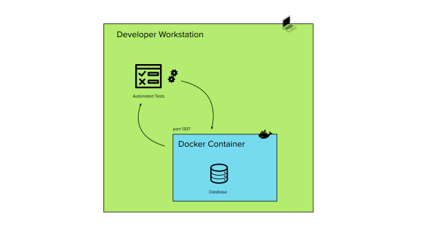
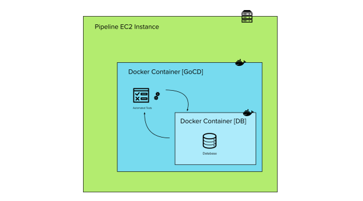
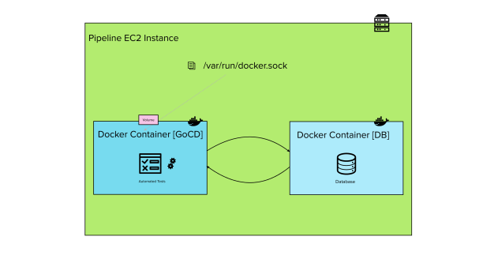
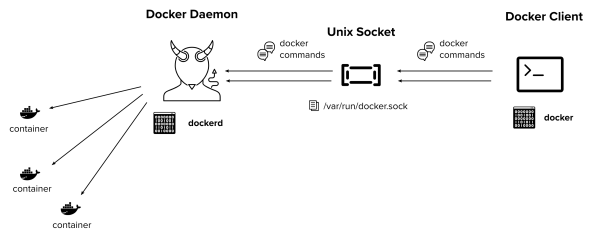
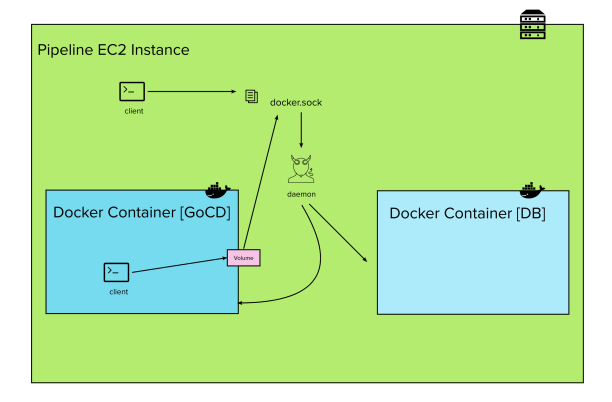
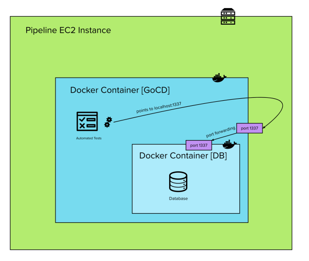
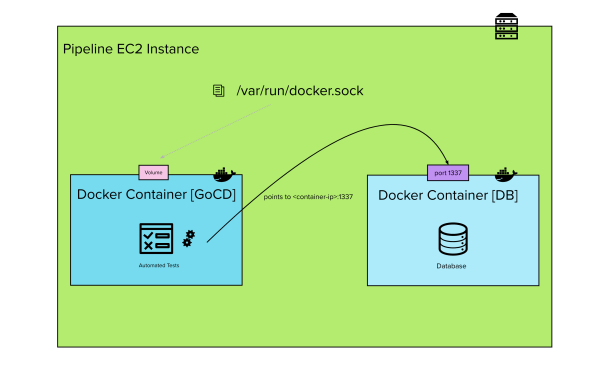

There are some tests (integration, end to end, component…) in most modern test suites that rely on some external resources in order to run. Confusing industry terminology aside, their goal is to test the integration between some part of our application and the outside world, like a database or a queue or even some other team’s application.

This is often accomplished by having a Docker container pretend to be the external entity we wish to mock – which is easy enough to set up in a developer’s laptop:



However, things get a bit more tricky once the same test setup has to be run in the team’s CI pipeline.

The reason being, a lot of modern CI/CD tools like Jenkins, GoCD etc. rely on their build agents being Docker containers themselves.

This presents developers who wish to run integration tests in their CI with the task of spawning Docker containers from within other Docker containers, which is not trivial as we are about to see.

## Making Docker in Docker work



It used to not be possible to run Docker inside Docker because of some low level black magic not being available in an underprivileged environment like container, which is needed by Docker to run.

All of that changed with [this update](https://www.docker.com/blog/docker-can-now-run-within-docker/), which introduced the concept of privileged mode, where a container can effectively be run with almost all the capabilities of the host machine.  
You can leverage privileged mode to create a container that is able to spawn other containers (particularly, you will want to run your agent image in this way).

You can do so by adding the `--privileged` flag like this:

```shell
$ docker run --privileged <agent-image> <command>
```

Or, if you are using docker-compose:

```yaml
version: '3'
services:
  myagent:
    # other things
    privileged: true
```

You need to make sure that Docker is installed in the agent image you are using, along with all of its dependencies. You can refer to the article above and/or to the `Dockerfile` of the `dind` (Docker in Docker) image: [https://github.com/jpetazzo/dind/blob/master/Dockerfile](https://github.com/jpetazzo/dind/blob/master/Dockerfile).

#### Running the tests

If you managed to configure your agents in this way, you should be able to run your tests with the same setup as you had in the local environment.

Your container will be simply started by the now privileged agent instead of the host machine, but all of that should be transparent to the application.

#### Issues

However simple it looks , this approach presents some undesired complications:

-   There is a long list of dependencies to install in order for Docker to work inside the container, some or all of which might not be present in the images you’re working with. Therefore there might be quite a lot of fiddling to do just to get it running.
-   Docker in Docker is still not 100% free of low level, hard to debug issues, as [this article](https://jpetazzo.github.io/2015/09/03/do-not-use-docker-in-docker-for-ci/) sums up.
-   Running containers in privileged mode is [dangerous](https://www.trendmicro.com/en_us/research/19/l/why-running-a-privileged-container-in-docker-is-a-bad-idea.html), and opens the possibility of privilege escalation by malicious users of CI server. Since our CI servers are also usually deploying infrastructure (and they need the necessary roles and permissions to destroy it), they can be one of the most dangerous systems in our organisation to leave poorly secured.

## A better approach: shared docker.sock



For most pipelines there is not a real need to have docker containers used for tests running _within_ the agent container.  
The requirement most often is just rather to be able to _start_ a docker container from some test code running within the agent, but then the container could theoretically run anywhere that can be reached by our application for the purpose of our tests.  
For this reason, another possible setup for our pipeline is Docker **beside** Docker, instead of Docker within Docker.

We can achieve this setup by sharing the UNIX socket file used by docker as a volume inside the agent container. In order to understand how this works, let’s first go through a high level refresher of the Docker architecture.

#### The Docker Architecture



Docker uses three high level components in order to work:

-   **Docker Daemon**  is the persistent process that manages containers in the background. Docker uses different binaries for the daemon and client.
-   **Unix Socket**: The `docker.sock` is the UNIX socket that the Docker daemon is listening to. It’s the main entry point for the Docker API and what the client will send the commands to. It is located in `/var/run`.
-   **Docker Client** the base binary that provides the Docker CLI to the user. Communicates with the daemon through the docker.sock

The same socket can be used by multiple clients, which makes this alternative solution possible.

#### Sharing the docker.sock

We want a docker client inside our pipeline agent to the host machine’s Docker socket. This way the agent is able to start “sibling” containers by talking to the daemon running on the host (instead of its own daemon like in the previous solution).

We can achieve this by sharing the host’s `/var/run/docker.sock` file to the agent container as a volume.



The Docker client on the agent would then speak to `/var/run/docker.sock` as if it was its own local one.

This is the command we would run with the CLI

```shell
$ docker run -v /var/run/docker.sock:/var/run/docker.sock  <agent-image> <command>
```

And the service definition if we are using docker-compose

```yaml
version: '3'
services:
  myagent:
    # other things
    volumes:
      - /var/run/docker.sock:/var/run/docker.sock
```

#### Running the tests

Unfortunately, unlike the previous solution, we must now take into account that the container we are talking to is not a child of the current one.  
Therefore, any network setup that relies on that being the case will not work anymore.  
As an example, locally and in the previous solution we might have been running our tests against `localhost:port` by making use of the port forwarding feature like this:



However when the daemon is shared the same port forwarding will actually refer to the host’s view of “localhost”, not the agent’s.  
Therefore we have to re-think our approach and refer to the container by its IP address instead:



You can get a container’s IP address in a number of ways, like this command through the Docker CLI

```shell
$ docker inspect -f '{{range.NetworkSettings.Networks}}{{.IPAddress}}{{end}}' <container>
```

Or programmatically, for example if you’re using Java and [the Test Containers library](https://www.testcontainers.org/)…

```java
String containerIp = container.getContainerIpAddress();
```

The only problem with IP addresses of containers is they are not very reliable and might change, so we might prefer a more stable, non programmatic way to refer to our containers in the code.

Docker happens to offer a DNS resolution service, where it assigns stable names to containers which are in the same user defined network. We can leverage this feature by fiddling around and trying to get the database container and the agent container on the same network, for example with this connect command:

```shell
$  docker network connect <database-network-name> <agent-container-name>
```

We should then be able to refer to the database container via its container name in our tests, like `my-db:<port>`. This is especially convenient when using docker-compose as we have the network already sorted out for us, with predictable default container names.

  
More details on DNS resolution and containers networking in the [official documentation](https://docs.docker.com/network/bridge/).

## Conclusion

There are two main ways to run docker containers from within our CI pipeline agents:

-   as **children** of our agent container, which might be complicated and open security holes
-   as **siblings** of our agent container, which is much more straightforward to setup and better indicated for security, but presents some overhead for the application to be able to reach the container

The second approach is definitely the most popular, even according to the people who wrote the feature which allows for Docker to run within Docker, but ultimately it is a tradeoff for the developers to consider.
