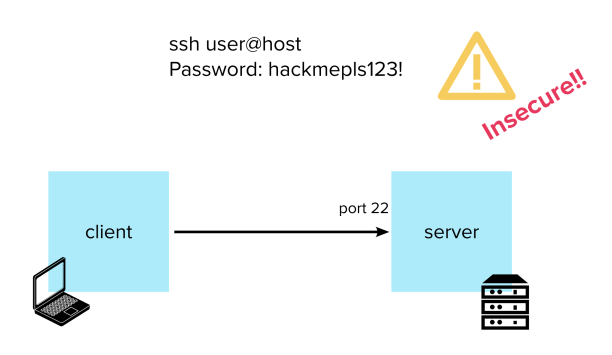
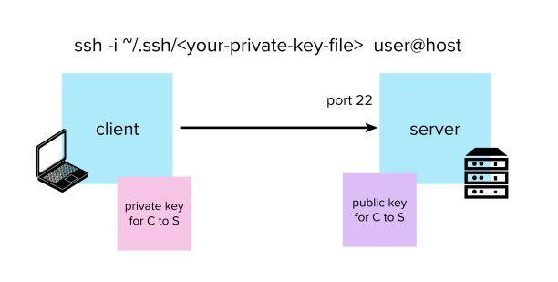
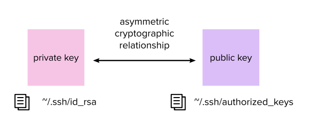

There are two ways of authenticating to a server with SSH: user/password-based authentication (which many now consider outdated and insecure) and key-pair-based authentication. Let’s start from the legacy one and build up to the modern way of doing things:

#### Username and Password Based Authentication



In this version, all you need to do to connect to your server is run:

```shell
$ ssh myuser@server
```

And you’ll be prompted for that user’s password (NB – the user is configured on the server, not on your client). Type it, press Enter and voilà – you now have an open shell into the server.

##### How to set it up

You can enable this type of authentication on the server simply by making sure that the following lines are present in the file `/etc/ssh/sshd_config` for an existing user that you want to authenticate with:

```
Match User <username>
PasswordAuthentication yes
```

Then restart the SSH daemon with:

```shell
$ sudo service sshd restart
```

Remember that you can change the password of the user (you should set a strong one) by running:

```shell
$ sudo passwd <username>
```

While this approach might be simple and familiar, it presents many security issues:

-   It is very vulnerable to brute force attacks
-   Bad (easily guessable) passwords are everywhere
-   It can be shoulder surfed or read with a keylogger
-   The password has to be sent by the SSH client to the server over the network – which means it is vulnerable to man-in-the-middle attacks and/or an SSH daemon modified by a malicious actor

Most of these are addressed by key-pair-based authentication, which is the way to go nowadays.

#### Key Pair Based Authentication



The idea is to assign a pair of _asymmetric keys_ to every user that needs authentication. Users will store their public key on every server they want to use, while their private key will remain secret and be safely stored on their computers.

That way, instead of inputting a password, your client can authenticate by specifying the private key file to the `ssh` command with the `-i` option:

```shell
$ ssh -i ~/.ssh/<your-private-key-file-name> myuser@server
```

Private keys are usually stored in the user’s `~/.ssh` folder, while public keys live in the `~/.ssh/authorized_keys` file on the server.

When a connection is attempted, the server will verify that the request was signed by one of the allowed private keys. (See below for how that is accomplished.)

##### How to set it up

Generate a key pair with:

```shell
$ ssh-keygen -t rsa -f ~/.ssh/key_name_id_rsa
```

_You will be asked to enter a passphrase for the key. This is optional and you can leave it empty, but you should definitely set one if you want an extra security layer (the key will be stored in encrypted form and you will be asked for the passphrase every time you try to use it with an SSH client)._

This will generate two files:

-   `~/.ssh/key_name_id_rsa` (private key)
-   `~/.ssh/key_name_id_rsa.pub` (public key)

You can now copy the contents of the public key file into your server’s `~/.ssh/authorized_keys` file.

Next, set the right permissions for your private key with:

```shell
$ chmod 600 ~/.ssh/key_name_id_rsa
```

This should allow you to ssh safely into the server with your private key.

* * *

**_Tip_:**

As well as holding your public keys, `authorized_keys` can restrict what users are allowed to do over SSH, such as which commands they can run:

```
command="/usr/local/bin/your_script.sh", ssh-rsa auiosfSAFfAFDFJL1234214DFAfDFa...
```

Or from which host a user is allowed to authenticate:

```
from="yourhost,anotherhost", ssh-rsa auiosfSAFfAFDFJL1234214DFAfDFa...
```

Etc.

* * *

##### How a key pair works




Pairs of public and private keys have a special asymmetric cryptographic relationship: everyone holding the public key can verify that a message was signed with the corresponding private key – but without ever having access to the private key itself.

This is accomplished by using mathematical functions called _one-way functions_: operations which are easy to perform, but hard for an eavesdropper to reverse.

You can read more about public key cryptography [here](https://en.wikipedia.org/wiki/Public-key_cryptography), or watch the excellent video below for a simple explanation:

<iframe class="video"
        src="https://www.youtube-nocookie.com/embed/NmM9HA2MQGI"
        title="Secret Key Exchange (Diffie-Hellman) – Computerphile"
        loading="lazy"
        allow="accelerometer; clipboard-write; encrypted-media; gyroscope; picture-in-picture"
        allowfullscreen></iframe>

### [Next: Known Hosts →](/blog/ssh-known-hosts/)

#### [← Previous: Introduction](/blog/ssh-for-developers-beyond-the-basics-series/)

### Table of Contents:

1.  [Introduction](/blog/ssh-for-developers-beyond-the-basics-series/)
2.  [Authentication](/blog/ssh-authentication-methods/)
3.  [Known Hosts](/blog/ssh-known-hosts/)
4.  [SSH Agent](/blog/ssh-agent/)
5.  [Config](/blog/ssh-config/)
6.  [Jumping Hosts](/blog/jumping-ssh-hosts/)
7.  [Tunnelling and Port Forwarding](/blog/ssh-tunnelling-and-port-forwarding/)
8.  [X11 Forwarding](/blog/ssh-x11-forwarding/)
9.  [Multiplexing and Master Mode](/blog/ssh-multiplexing-and-master-mode/)
