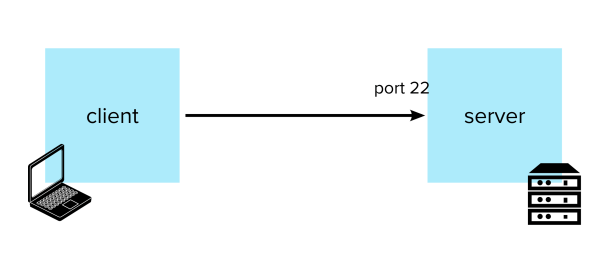

I have written this guide for developers who might be superficially familiar with the basics of SSH – maybe even fiddled with a file or two without really knowing what’s going on – and would like a more cohesive overview of its most powerful features.

This is essentially an organised collection of the main gotchas and topics that gave me (a dev, not a sysadmin) the most dexterity in jumping about from machine to machine in the cloud.  
It is meant to be read in sequence, as each topic builds on the previous one, but I also tried to keep them loosely coupled in case the reader is only interested in a particular topic.

Have fun.

## Table of Contents:

1.  [Authentication](/blog/ssh-authentication-methods/)
2.  [Known Hosts](/blog/ssh-known-hosts/)
3.  [SSH Agent](/blog/ssh-agent/)
4.  [Config](/blog/ssh-config/)
5.  [Jumping Hosts](/blog/jumping-ssh-hosts/)
6.  [Tunnelling and Port Forwarding](/blog/ssh-tunnelling-and-port-forwarding/)
7.  [X11 Forwarding](/blog/ssh-x11-forwarding/)
8.  [Multiplexing and Master Mode](/blog/ssh-multiplexing-and-master-mode/)

_Disclaimer: this is not meant to be a complete list of all that is possible with SSH. That would probably take a book. Or two. But any feedback about additions is welcome._

## First, a refresher. What _is_ SSH?

SSH is a protocol built on top of TCP that is intended to provide a secure channel for a client and a server to communicate. In its implementation, it consists of two programs:

-   An SSH client
-   An SSH daemon on the server that accepts connections, typically on port 22

Both the client program and the daemon are commonly pre-installed on most modern Unix-like operating systems.  
Other little helper tools like `ssh-keygen`, `ssh-agent` and `ssh-add` are also part of the family of SSH executables.

SSH was originally designed as a replacement for Telnet and older, unsecured remote shell protocols. The encryption used by SSH is intended to provide confidentiality and integrity of data over unsecured networks, such as the Internet. _Fun fact: it was developed by a fucked off engineer in response to a password-sniffing attack on a university network._

This kind of security is typically thought of as necessary to log into a remote machine and execute commands here and there, but SSH also supports many other advanced use cases such as tunnelling, forwarding TCP ports, transferring files, X11 forwarding, etc., which we’ll see later.

First, let’s make sure we properly cover the main feature and selling point of SSH: authentication.

### [Next: Authentication →](/blog/ssh-authentication-methods/)

### Resources and Further Reading

-   [https://www.ssh.com/ssh/agent](https://www.ssh.com/ssh/agent)
-   [https://security.stackexchange.com/questions/20706/what-is-the-difference-between-authorized-keys-and-known-hosts-file-for-ssh](https://security.stackexchange.com/questions/20706/what-is-the-difference-between-authorized-keys-and-known-hosts-file-for-ssh)
-   [https://www.redhat.com/sysadmin/ssh-proxy-bastion-proxyjump](https://www.redhat.com/sysadmin/ssh-proxy-bastion-proxyjump)
-   [https://medium.com/kernel-space/why-using-ssh-agent-forwarding-is-a-bad-idea-6cbdff31bbee](https://medium.com/kernel-space/why-using-ssh-agent-forwarding-is-a-bad-idea-6cbdff31bbee)
-   [https://www.cyberciti.biz/faq/linux-unix-ssh-proxycommand-passing-through-one-host-gateway-server/](https://www.cyberciti.biz/faq/linux-unix-ssh-proxycommand-passing-through-one-host-gateway-server/)
-   [http://unixetc.co.uk/2017/11/13/ssh-proxying-and-agent-forwarding/](http://unixetc.co.uk/2017/11/13/ssh-proxying-and-agent-forwarding/)
-   [https://stackoverflow.com/questions/22635613/what-is-the-difference-between-ssh-proxycommand-w-nc-exec-nc](https://stackoverflow.com/questions/22635613/what-is-the-difference-between-ssh-proxycommand-w-nc-exec-nc)
-   [https://linuxize.com/post/how-to-setup-ssh-tunneling/](https://linuxize.com/post/how-to-setup-ssh-tunneling/)
-   [https://help.ubuntu.com/community/SSH/OpenSSH/PortForwarding](https://help.ubuntu.com/community/SSH/OpenSSH/PortForwarding)
-   [https://blog.scottlowe.org/2015/12/11/using-ssh-multiplexing/](https://blog.scottlowe.org/2015/12/11/using-ssh-multiplexing/)
