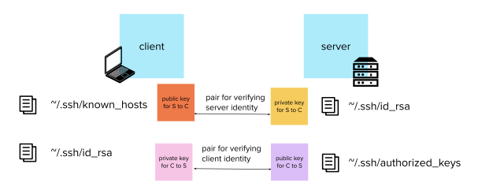

Much like how the `authorized_keys` file is used to authenticate clients on the server, there is another file in the `~/.ssh` folder called `known_hosts`, which is used to authenticate servers to the client.

Whenever SSH is configured on a new server it always generates a public and private key pair for the server, just like you did for your user in the [Authentication](/blog/ssh-authentication-methods/) post. Every time you connect to any SSH server, it shows you its public key first, together with a proof that it possesses the corresponding private key. If you do not have its public key yet, then your computer will ask for it and add it into the `known_hosts` file.



This way, the client can check that the server is a known one, and not some rogue server trying to pass itself off as the right one.

That’s why when you connect to a server for the first time, you might get a message like this:

```
$ ssh myuser@myserver
The authenticity of host 'myserver (192.0.2.103)' can't be
established. ECDSA key fingerprint is ...
Are you sure you want to continue connecting (yes/no)? yes
Warning: Permanently added 'myserver,192.0.2.103' (ECDSA) to the list of known hosts.
```

When you enter yes, the client appends the server’s public key to the user’s `~/.ssh/known_hosts`. The next time you connect to the remote server, the client compares this key to the one the server supplies. If the keys match, you are not asked if you want to continue connecting.

However, if the client already has the key and it does not match…

```
@@@@@@@@@@@@@@@@@@@@@@@@@@@@@@@@@@@@@@@@@@@@@@@@@@@@@@@@@@@
@    WARNING: REMOTE HOST IDENTIFICATION HAS CHANGED!     @
@@@@@@@@@@@@@@@@@@@@@@@@@@@@@@@@@@@@@@@@@@@@@@@@@@@@@@@@@@@
IT IS POSSIBLE THAT SOMEONE IS DOING SOMETHING NASTY!
Someone could be eavesdropping on you right now (man-in-the-middle attack)!
It is also possible that the RSA host key has just been changed.
The fingerprint for the RSA key sent by the remote host is
dd:cf:50:31:7a:78:93:13:dd:99:67:c2:a2:19:22:13.
Please contact your system administrator.
Add correct host key in /home/user/.ssh/known_hosts to get rid of this message.
Offending key in /home/user/.ssh/known_hosts:7
RSA host key for 192.168.219.149 has changed and you have requested strict checking.
Host key verification failed.
```

You might get this message, informing you that the server you are speaking to might not be who you think it is, and you might be the victim of a man-in-the-middle attack.

However, there are also legitimate reasons for your server’s identification to have changed. Maybe the SSH software was upgraded, or the machine behind that IP address has died and another one has taken its place (a common occurrence when developing in a cloud environment).

If you have identified that the change happened for a good reason, all you need to do is remove the line with the outdated public key from the `~/.ssh/known_hosts` file manually, or with this handy command:

```shell
$ ssh-keygen -R <hostname or IP address>
```

And the client will magically forget it ever knew who that server was, allowing you to connect once again.

### [Next: SSH Agent →](/blog/ssh-agent/)

#### [← Previous: Authentication methods](/blog/ssh-authentication-methods/)

### Table of Contents:

1.  [Introduction](/blog/ssh-for-developers-beyond-the-basics-series/)
2.  [Authentication](/blog/ssh-authentication-methods/)
3.  [Known Hosts](/blog/ssh-known-hosts/)
4.  [SSH Agent](/blog/ssh-agent/)
5.  [Config](/blog/ssh-config/)
6.  [Jumping Hosts](/blog/jumping-ssh-hosts/)
7.  [Tunnelling and Port Forwarding](/blog/ssh-tunnelling-and-port-forwarding/)
8.  [X11 Forwarding](/blog/ssh-x11-forwarding/)
9.  [Multiplexing and Master Mode](/blog/ssh-multiplexing-and-master-mode/)
