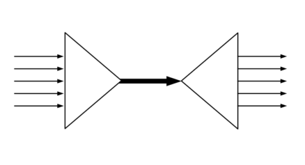

When using SSH bastion hosts it is common to set up new connections for many of the use cases discussed in the previous section throughout the day.  
Normally we would start a new TCP connection for each one of them. However, open TCP connection are a finite resource on any machine, and each one of them takes some time to set up.



Multiplexing is a feature provided by SSH which alleviates these problems. It allows a single TCP connection to carry multiple SSH sessions. The TCP connection will be established and kept alive for a specific period of time and new SSH sessions will be established over that connection.

It works by creating a “control socket” file which will be used every time we want start a new connection.

We need to pass two command line arguments in order to leverage this feature:

-   `-M` enables the sharing of multiple sessions over a single TCP connection, or enables “Master Mode”.
-   `-S` specifies the control socket file which will be used or created (SSH will create it for you on that path).

Example: we can open a tunnel in master mode with

```shell
$ ssh -M -S ~/.ssh/my-socket -L <port>:server:<port> user@jump-host
```

_The socket file should be kept somewhere safe like the `~/.ssh` folder_

Then we could set up a dynamic port forwarding on the same bastion host with

```shell
$ ssh -M -S ~/.ssh/my-socket -D <port> user@jump-host
```

Without paying the cost of setting up a new connection.  
This is also useful even when we don’t have a jump host, but we want to run lots of commands over SSH repeatedly on the same server.

We can close the TCP connection (and any SSH connection still alive with it) by using the `-O` option with the `exit` command:

```shell
$ ssh -S ~/.ssh/my-socket -O exit user@jump-host
```

The `-O` flag allows in general to pass any command to an active connection multiplexing master process. Other valid commands are:

-   `check` to verify that the master process is running
-   `forward` to request forwardings without command execution
-   `cancel` to cancel any forwardings
-   `exit` which requests the master process to exit
-   `stop` to tell the master process to not accept any further multiplexing requests

More information on the ssh man page.  
Due to the flexibility and ease of use of this variety of commands, I often use master mode when needing to set up, check health and tear down tunnels in automation scripts (it is much nicer than running it as a background process and then killing its PID when no longer needed).

##### Configuration equivalent

We can also specify we would like to use master mode in our `~/.ssh/config`, for example

```
Host bastion
  Hostname bastion-host
  ControlPath ~/.ssh/my-socket
  ControlMaster auto
  ControlPersist 10m

Host 172.16.*
  ProxyJump bastion
```

will allow us to use the bastion host in multiplexing mode for all connections to an IP address matching the pattern.

The options mean the following:

-   `ControlPath` is an equivalent to `-S`, and specifies the control socket file which will be used or created
-   `ControlPersist` allows us to specify for how long the master TCP should be kept active when it is idle. It has no command line equivalent
-   `ControlMaster` activates the master mode. When written in config file, more than one value is possible:
    -   “yes”  which makes SSH listen for connections on the control socket
    -   “auto”  try to use a master connection but fall back to creating a new one if one does not already exist
    -   “no” the default, disables master mode
    -   _more on the SSH man page_

##### Restrictions

From the SSH documentation:

> X11 and ssh-agent forwarding is supported over these multiplexed connections, however the display and agent forwarded will be the one belonging to the master connection i.e. it is not possible to forward multiple displays or agents.

#### [← Previous: X11 Forwarding](/blog/ssh-x11-forwarding/)

### Table of Contents:

1.  [Introduction](/blog/ssh-for-developers-beyond-the-basics-series/)
2.  [Authentication](/blog/ssh-authentication-methods/)
3.  [Known Hosts](/blog/ssh-known-hosts/)
4.  [SSH Agent](/blog/ssh-agent/)
5.  [Config](/blog/ssh-config/)
6.  [Jumping Hosts](/blog/jumping-ssh-hosts/)
7.  [Tunnelling and Port Forwarding](/blog/ssh-tunnelling-and-port-forwarding/)
8.  [X11 Forwarding](/blog/ssh-x11-forwarding/)
9.  [Multiplexing and Master Mode](/blog/ssh-multiplexing-and-master-mode/)
