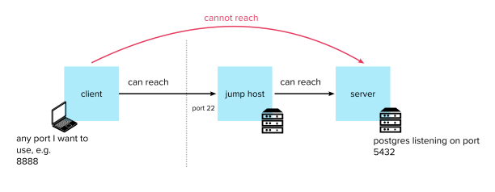
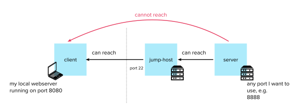
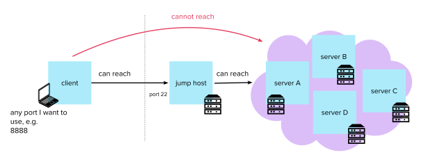

In the previous section we saw how to make use of a jump host as a proxy to run commands into a remote machine.  
Sometimes however, having a shell is not necessary, and the connectivity aspect of having a secure channel to the remote host is way more interesting.  
SSH’s port forwarding feature allows us to create a secure channel to the remote host, and then use it to carry any type of traffic back and forth.

#### Local Port Forwarding

Scenario: you want to reach a specific application (which listens on a specific port) on the remote server.



For example (as in the image) we might want to connect to a PostgreSQL database application that is listening on port 5432 on the remote server, which is in a private subnet.

The `-L` option is used to tell SSH that it should forward traffic from any port on our machine through the jump host and to a port on of the destination server.

This is similar to what the `ProxyCommand` in the previous section was doing, except instead of us sending data through the stdin, SSH will allocate a socket to listen to the port on the local side. Whenever a connection is made to this port, it will be forwarded to the secure channel.

```shell
$ ssh -i ~/.ssh/jump_id_rsa -L 8888:server:5432 user@jump-host
```

In our case we have forwarded port 8888 of our machine to the port 5432 of the remote server running PostgreSQL.  
We can now reach the database on the private subnet through port 8888 on localhost, e.g.:

```shell
$ psql -W -h localhost -p 8888 postgres postgres
```

#### Remote Port Forwarding

Scenario: you want the remote server to access specific application running on your local machine (which listens on a specific port)



For example (as in the image) we might want the remote server to be able to visit a page served by a webserver running on our laptop.

The `-R` option is used to tell SSH that it should forward traffic from any port on the remote machine through the jump host and to a port on our local machine.  
It works exactly like local port forwarding, only the other way around: the SSH daemon will allocate a socket to listen to the port on the remote side.

```shell
$ ssh -i ~/.ssh/jump_id_rsa -R 8080:server:8888 user@jump-host
```

In our case we have forwarded port 8888 of the server to the port 8080 of our local machine, where a webserver is running.  
We can now request a page from the remote server by running, for example:

```shell
$ wget http://localhost:8888/path/to/resource
```

#### Dynamic Port Forwarding

Scenario: you want to reach a entire network (any application on any port) by using the jump host as a proxy for all your traffic



For example, we might have a lot of machines running webservers which are only accessible from a campus network. We don’t have access to that network, but somebody set up a bastion host for us which we can use as a proxy. However setting up local port forwarding for each and every server is a tedious process, and we would rather tell our web browser to route traffic through the bastion for all our traffic.

Luckily the `-D` flag allows you to turn your SSH client into a rudimentary SOCKS proxy server. When a client connects to this port (your web browser, for example), the connection is forwarded to the jump host, which is then forwarded to a dynamic port on any destination machine.

```shell
$ ssh -i ~/.ssh/jump_id_rsa -D 8888 user@jump-host
```

This creates a SOCKS proxy on port 8888. You can configure your browser for example to send its traffic through a SOCKS tunnel using [this guide](https://linuxize.com/post/how-to-setup-ssh-socks-tunnel-for-private-browsing/).  
You can now reach the entire network of servers through port 8888 (you can send any type of traffic, directed to any port to any host).

_This is different from a VPN because it does not intercept all traffic, and each application that wishes to use the proxy has to explicitly route the traffic to the local port._

### [Next: X11 Forwarding →](/blog/ssh-x11-forwarding/)

#### [← Previous: Jumping Hosts](/blog/jumping-ssh-hosts/)

### Table of Contents:

1.  [Introduction](/blog/ssh-for-developers-beyond-the-basics-series/)
2.  [Authentication](/blog/ssh-authentication-methods/)
3.  [Known Hosts](/blog/ssh-known-hosts/)
4.  [SSH Agent](/blog/ssh-agent/)
5.  [Config](/blog/ssh-config/)
6.  [Jumping Hosts](/blog/jumping-ssh-hosts/)
7.  [Tunnelling and Port Forwarding](/blog/ssh-tunnelling-and-port-forwarding/)
8.  [X11 Forwarding](/blog/ssh-x11-forwarding/)
9.  [Multiplexing and Master Mode](/blog/ssh-multiplexing-and-master-mode/)
