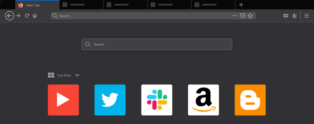

If you are using SSH between Unix-like operating systems, you can also forward GUI applications over SSH. This is especially useful if your server doesn’t really have a user interface, but you need to check something on the fly with a web browser running on it.



This is possible because all Unix-like systems share a common GUI windowing system called X11, which is what provides the basic framework for the desktop environment: drawing and moving windows on the display device and interacting with a mouse and keyboard, etc.

This will also work on macOS, although you will need to install and start the [X11 server](https://www.xquartz.org/) on your Mac first.

To enable this, make sure that on the server side the lines:

```
X11Forwarding yes
X11UseForwarding yes
```

are present and uncommented in the SSH daemon configuration file `/etc/ssh/sshd_config`.  
You might need to restart the daemon if the changes don’t take effect.

The `xauth` program must also be installed on the server.

Once these two preconditions are met, you can run the SSH client with the `-X` option, which activates the X11 forwarding over the secure channel:

```shell
$ ssh -X user@server
```

And then run any GUI program on the shell on the server:

```shell
$ firefox
```

And the window will be rendered on your local machine instead.

You can also enable the forwarding on the client side by using the option in the configuration file:

```
Host server
    Hostname myserver
    ForwardX11 yes
```

### [Next: Multiplexing and Master Mode →](/blog/ssh-multiplexing-and-master-mode/)

#### [← Previous: Tunnelling and Port Forwarding](/blog/ssh-tunnelling-and-port-forwarding/)

### Table of Contents:

1.  [Introduction](/blog/ssh-for-developers-beyond-the-basics-series/)
2.  [Authentication](/blog/ssh-authentication-methods/)
3.  [Known Hosts](/blog/ssh-known-hosts/)
4.  [SSH Agent](/blog/ssh-agent/)
5.  [Config](/blog/ssh-config/)
6.  [Jumping Hosts](/blog/jumping-ssh-hosts/)
7.  [Tunnelling and Port Forwarding](/blog/ssh-tunnelling-and-port-forwarding/)
8.  [X11 Forwarding](/blog/ssh-x11-forwarding/)
9.  [Multiplexing and Master Mode](/blog/ssh-multiplexing-and-master-mode/)
