Note: a shorter, summarised version of this article has been published [on the Thoughtworks blog](https://www.thoughtworks.com/insights/blog/continuous-delivery/surviving-continuous-deployment-distributed-systems). Read the full article here or watch the talk delivered at **XConf Europe**:

# Introduction

This is an article about the day to day of software development.

The industry seems to be at a point where a lot of us are using good practices such as Trunk Based Development and/or Continuous Deployment, or we are at least hassling our managers about it working towards it. I’m also a big fan.

But, as cool and shiny as these practices are, and as much as we reassure our fellow developers and stakeholders that they are completely safe, I believe they do present some risks.

Not a lot is being said about how they affect the life of developers: as each change we make now goes immediately to production, it has the potential to affect a complex web of services. These services depend on each other in often intricate ways, and service interdependencies are among the hardest things to test. One mistake in a commit which our pipelines don’t catch, and production goes down. Or data is corrupted.

When deployments were slow and clunky and happened with a human pressing on a button, we at least had the chance to explicitly set aside some time to think about all of the above, and (maybe) resolve these intricacies before going live. But now that everything goes live _all the time_, without the chance to look at it first, the same cognitive load needs to be spread over everyday code making efforts. It doesn’t simply go away.

In this article, I want to share my approach to organizing this cognitive load: a framework to perform incremental, safe releases during everyday story work, which tries to reconcile our new one-commit = one-deploy developer workflow with the intricacies of distributed systems. This is a collection of mostly existing concepts and practices, but they are structured specifically around the challenges of CD.

## Who this is for

This article was written with two different groups in mind:

-   **Teams who are beginning to adopt Trunk Based Development and/or Continuous Deployment**: once a team removes the very final gate to production, there is sometimes a “now what?” moment. Nobody is used to this way of working, and one might start feeling insecure about the code being pushed all of a sudden. Yet it is important to not break the stakeholders’ trust (and the application in front of the users, most importantly).
-   **Programmers who have never used Trunk Based Development and/or Continuous Deployment**, and are joining a mature team which already adopted these practices a while ago. It can be very daunting to step into such a situation and suddenly, with little context of the application itself, having to check your work in which might or might not break something.

Having witnessed both situations, I had wished that there was some more organised material and literature to use myself or to share with my colleagues on the subject. This aims to be a step in that direction, and to shift the conversation explicitly to Continuous Deployment after we’ve been talking a lot about Continuous Delivery for so long.

## Disclaimer

This collection of practices is 1) very opinionated, as it is based on the author’s experience, and 2) by far not enough on its own to judge whether a team is ready to step into CD.

A healthy relationship with stakeholders, a robust TDD culture, a zero-downtime deployment strategy, infrastructure as code, a comprehensive suite of tests executed by a well-oiled pipeline…These are just _some_ of the prerequisites I would make sure are in place before removing the gate to production.  

# Recap of the practices

Before diving in, let’s take a moment to refresh some definitions.

### What is Trunk Based Development?

```
Trunk Based Development focuses on doing all work on Mainline (called “trunk” [...]), and thus avoiding any kind of long-lived branches.
```

### What is Continuous Deployment?

```
Continuous Deployment, means that every change on your mainline, or "trunk" branch goes through the pipeline and automatically gets put into production.
```

The concepts themselves are quite simple. If you’re new to this and want to understand the subject a little bit better before continuing, you should check out Martin Fowler’s blog, the Continuous Delivery book and maybe [this article](https://arxiv.org/abs/1703.07019).

## But why should we immediately send every commit to production?

It sure seems scary, but the one-commit = one-deploy workflow can drastically improve team productivity for several reasons. It’s outside of the scope of this article to explain in-depth why these practices are a good idea, but I will still try to summarise what I think are the main advantages of using them together:

-   **Immediate integration**: there is immediate feedback of how new changes integrate with other team member’s code, but also how they react to real production load, data, user behavior, third party systems etc. This means when a task is done it is _really_ done and proven to work, not “done pending successful deployment”. No more surprises after the developers forgot what the code that just got released was even doing.
-   **Smaller change deltas**: each individual release becomes less risky, simply because there is less stuff being released at any given time. When the only difference between a version and the next is a few lines of code, then finding bugs becomes trivial. If a revert is needed, it is also going to impact a very small functionality rather than delay a bunch of unrelated features.
-   **Developer friendliness** have you ever seen the git history of a repository where all the developers work on trunk? It’s straightforward. No branches, no guessing which commits are in which branch, no merge hell, no cherrypicking to fix merge hell, you get the gist. Also, all individual commits now have to be self consistent enough to be release candidates. So also no guessing what can be deployed where: ideally any revision is able to survive into production on its own.

# Example: Animal Shelter Management System

From this moment on, all of the concepts will be demonstrated using an example application.

  
We shall call it the “Animal Shelter Management System”, and it does exactly what the name says: allows animal shelter employees to manage every aspect of the life of their animal guests.  

It even has a fancy, modern UI:

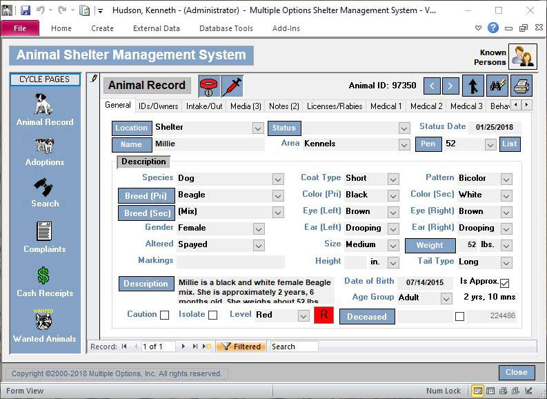

We will assume that this application is web-based and has a simple, idealized architecture, which might look very familiar to most developers. It has some sort of persistence – a relational database for our example – and a backend that acts as an API to a one-page application frontend. Also, we will assume the API collaborate with third-party systems to read or provide some data.

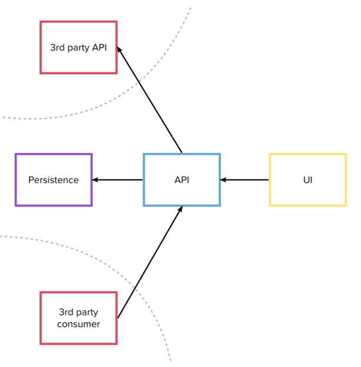

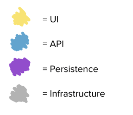

The source code to represent and deploy these components is split into two source control repositories. The first contains the backend code and the database evolutions, plus the infrastructure code to deploy them. In the second, we will find all the front-end code for our one-page application and again its own infrastructure code.

Each of the repositories has its own pipeline which runs all the tests and eventually deploys to production.

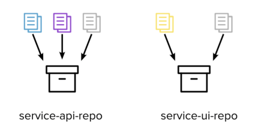

We will also assume that this application is already live, and it is being enjoyed by hundreds of thousands of users.

# The mindset shift

## Contracts between distributed components

When talking about distributed systems, we are used to thinking about contracts and everything that goes with them in the context of our system (and our team) versus the outside world.

For example, our API (consumer) might rely on a third party system to perform some task (producer), or vice versa. Every time we need a new feature or there is a change proposal our developers will need to interface with the people responsible for the outside system.  
  
These situations have been described extensively in the literature, and most organisations already have processes in place to deal with them, whether the third party is another team or a vendor.

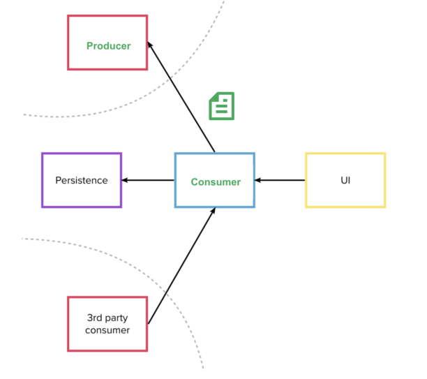

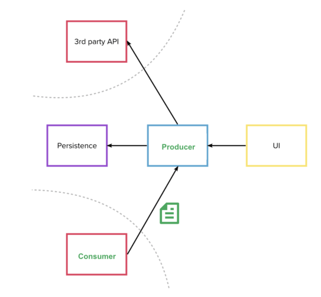

We don’t think that explicitly about contracts, however, when any given system which we would normally consider a “unit”, or a “microservice” has distributed sub-components within itself. We have distributed components the very moment that any sort of inter-process communication happens (over the network, using files, pipes, sockets etc.).  
Most non-trivial systems respect this definition.

Our Animal Shelter Management System is no exception, of course, having lots of obviously distributed bits and pieces: the persistence, API and UI are all talking to each other over the network.

And contracts certainly exist between them too: the UI consumes the API and expects it to respond in a certain way. Also, the API can also be seen as the consumer of the persistence layer, as it relies on a certain schema being available.

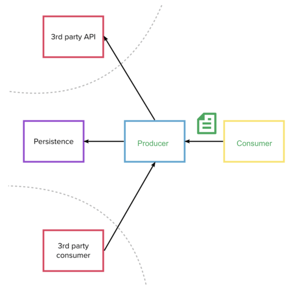

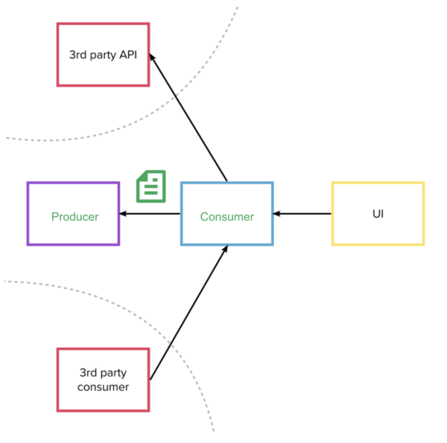

Why does this matter?  
  
Because any given task a developer starts can span across multiple of these distributed sub-components. If we have split our stories right, in fact, the developers will deliver features end to end by design. This is different than when there needs to be outward-facing communication: as the components are all owned by the same team, there is no process and certainly no meetings around making sure all changes are retro-compatible and happen in the right order between producer and consumer.

So how have developers been dealing with it?

## Order of Deployment

From my experience, when deployment to production is not happening every commit, dependencies between producers and consumers are usually managed by manually releasing each system’s changes in the correct order by the developers themselves (assuming we are in a cross-functional team). This means that anyone who picks up a task can mindlessly start working on whichever codebase they wish, as all of their changes will be waiting to be released correctly by humans clicking buttons.  
  
Or, we can say, code changes go live in their **order of deployment**.  
  
See the example below of a change spanning backend and frontend, in which the developers can start with the frontend (which would not do anything useful without the underlying API) but then they can make sure to release in the reverse order.

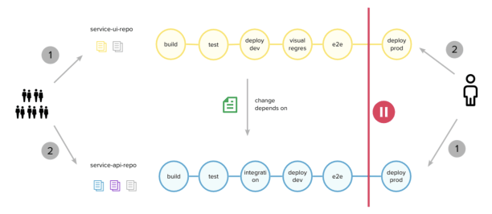

## Order of Development

Now imagine that the gate to production (and the human) have been removed. Suddenly changes don’t stop in  
some staging environment: they immediately get released.  

Or, features go live in their **order of development**.  

The same developers mindlessly deciding to start from one place or another would now release a UI change that has no business being in production before the API is finished.

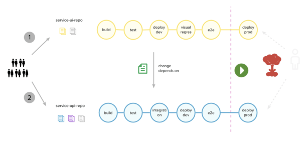

The only way to avoid these situations (without any extra practices) is to make sure that the order of development is the same order in which code changes should be released.

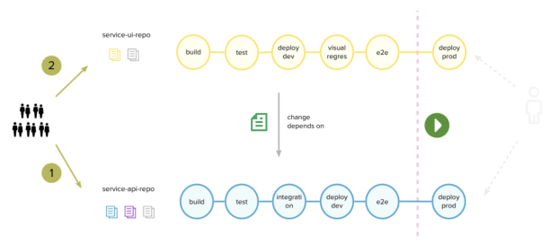

This is a substantial change from the past: developers used to be able to pick a new task and just start _somewhere_, maybe on the codebase they are most comfortable with or with the first change that comes to mind.  
Now it’s not enough to be able to know in advance which component needs changing and how, but also there needs to be a conscious decision and planning of all code changes going live at the granularity of individual commits.  
So, quite a lot of preparation is needed just start typing.

In the following sections we’ll see how it’s possible to deal with (or remove) some of this planning overhead by following different approaches based on the type of code change being introduced:

-   New features addition
-   Refactoring live features

As each of them has different implications.

# Adding new features

Let’s begin with our first example. Imagine we have the following user story in our backlog:

* * *

`**As an** animal shelter volunteer`

`**I want to** be reminded when animals need feeding`

`**So that** their diet can be on an accurate schedule`

* * *

This implies adding a reminder section to our interface, with a navigation option to access it and an “add reminder” button.

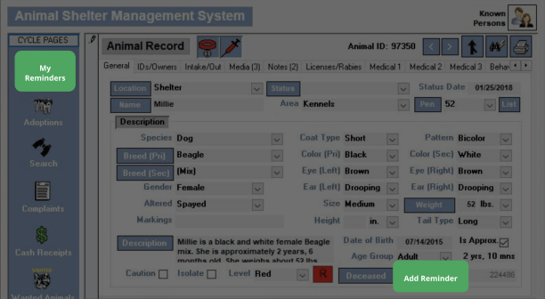

## Target state

Given these requirements, we will first imagine what is the target state of all the codebases that make up our system.

**Frontend**

The frontend needs an “Add Reminder” button which, when clicked, might call a `remindMe()` function. This function will call the backend with the information of our reminder. We will also need an extra `<li>` in the navbar’s `<ul>` to link to our new “Reminders” section.

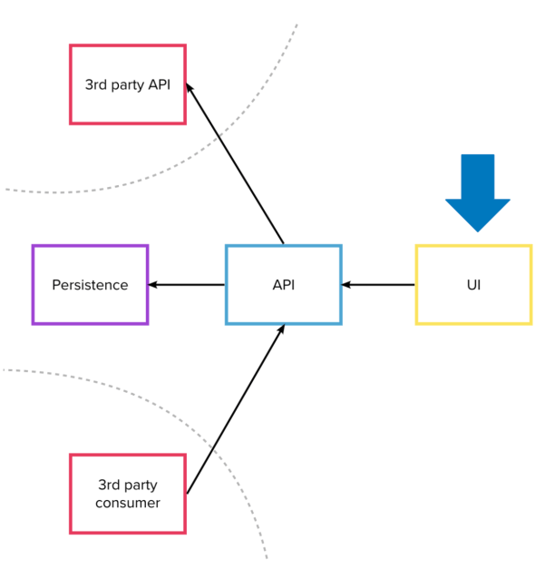

```js
const remindMe = () => {
   const url = `https://my-service-api/user/${userId}/reminder`

 fetch(url,{ method: 'POST', body: {/*details*/} })
  .then(success())
  .catch(error())
}
```

```html
<!-- in the main navigation -->
<ul id="main-nav"> 
  <!-- ... other menu items ... -->
  <li id="reminders-nav">
    <a>My reminders</a>
  </li>
  <!-- ... other menu items ... -->
</ul>

<!-- somewhere in the page -->

<button id="reminders-btn" onclick="remindMe()">
 Remind me
</button>
```

**Backend**

The backend needs endpoints to create new reminders and see existing ones. They can be under an existing `UserController` since reminders are associated with a user.

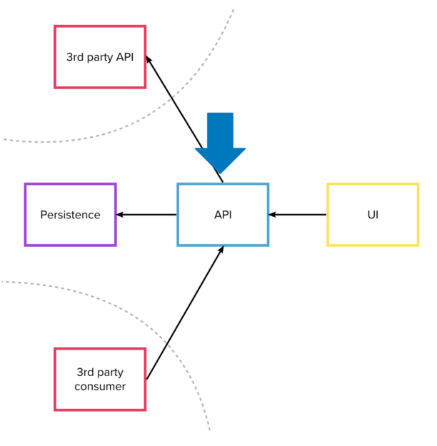

```java
@RestController
class UserController {

  ... //other user related endpoints

   @PostMapping("/user/{id}/reminder")
   Reminder newReminder(
        @PathVariable Long userId,
        @RequestBody ReminderPayload newReminder
        ) {
     return repository.save(newReminder, userId);
   }

   @GetMapping("/user/{id}/reminder")
    List<Reminder> allForUser(
      @PathVariable Long userId
      ) {
      return repository.findAllFor(userId);
    }
 
}
```

**Persistence**  
Finally, we will need a table to persist the reminders.

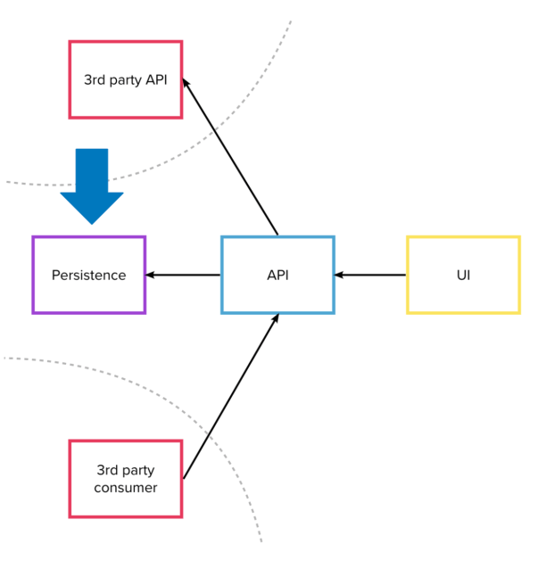

```
Table "public.reminders"

Column    |  Type   | 
-------------+---------+
reminder_id | integer | 
identifier  | uuid    | 
user_id     | integer | 
interval    | integer | 

Indexes:
"reminders_pkey" PRIMARY KEY, btree (reminder_id)
Foreign-key constraints:
"reminders_user_id_fkey" FOREIGN KEY 
  (user_id) REFERENCES users(user_id)
```

## How do we get there without breaking production?

Without Continuous Deployment we might simply start implementing from one of these three places and then continue working in no particular order. But, as we saw before, now that everything is going to production immediately we need to pay a bit more attention. If we wanted to avoid exposing broken functionality, we would need to start with the producer systems first, and gradually move upwards to the interface.

This allows every consumer to rely on the component underneath, with the UI eventually being released on top of a fully working system, ready for users to start creating reminders.

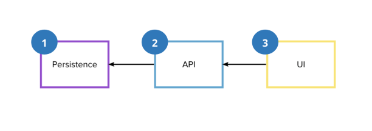

This approach certainly works – but is the optimal way to approach new features? What if we prefer to work another way?

## Outside-In

Many developers prefer to approach the application from the outside in when developing something new. Especially if they are practicing “outside-in” TDD and would love to write a failing end to end test first. Again, it is out of the scope of this article to explain all of the benefits of this practice, but here is a summary:

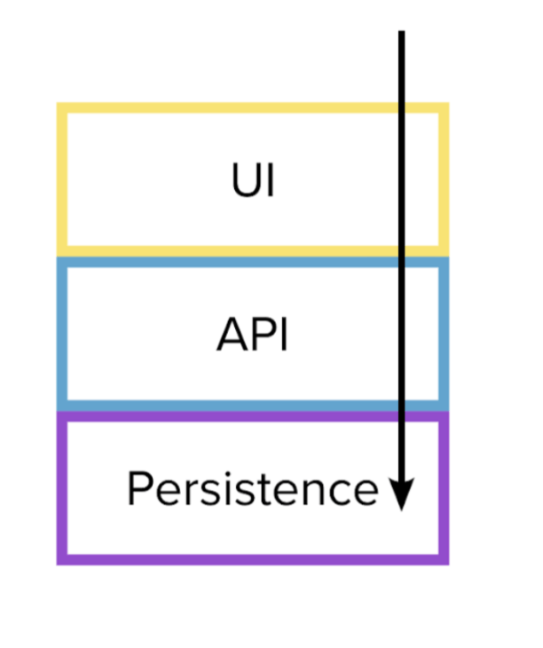

-   Starting by the layers visible to the user allows for early validation of the business requirements: if it is unclear what should be the visible effects of the feature from the outside, this step will reveal it immediately. Starting development becomes the last responsible moment for challenging badly written user stories.
-   The API of each layer is directly driven by its client (the layer above it), which makes designing each layer much simpler and less speculative. This reduces the risk of having to re-work components because we did not foresee how they would be invoked, or to add functionality that will end up not being used.
-   It works really well with the “mockist”, or London school of TDD approach to implement one component at a time, mocking all of its collaborators.

But, this implies that the order ideal for development is exactly the opposite of the order needed to not break the application!

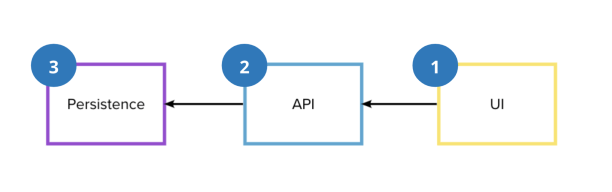

In the following section, we will see a technique we can use to resolve this conflict.

## Feature Toggles (or Feature Flags)

Feature Toggles are a technique often mentioned together with CI/CD. Quoting Pete Hodgson, a feature toggle is a flag that allows to “ship alternative code paths within one deployable unit, and choose between them at runtime”.

In other words, they are boolean values that you can use in your code to decide whether to execute one branch of behaviour or another. Their value usually comes from some state external to the application (S3 bucket, parameter store, database, a file somewhere, etc….) so that they can be changed independently of deployment.

In other words, creating a feature toggle means putting an if statement.

```java
if (useNewAlgorithm) {
   return newWayOfCalculatingResult();
} else {
   return oldWayOfCalculatingResult();
}
```

With Continuous Deployment, we can use them to decouple the order of changes needed to not break contracts from the order in which we want to develop. This is achieved by using the feature toggle to hide half baked functionality from the users, even if its code is in production.

**Other feature toggle benefits**

Feature toggles that have some advanced configuration options can be used to do even fancier things: perform QA directly in production (only enable feature toggle by user id or by a special header), A/B testing (only enable the toggle if the user sessions fall into test group or control group), gradual ramp-up to release features slowly (toggles activated by percentage), etc.

You can just check out one of the many feature toggles libraries to see if they have these features.

## Implementing with a Feature Toggle

We can try to proceed outside-in by simply adding a feature toggle to the UI, like this:

**Step 1: Adding the frontend code under a toggle**  
We can just add the same code we would have in the target state, but with the addition of a toggle. This will hide the new elements (button and menu item while the feature is still disabled. The code can go to production immediately, even without the API being ready, as the user won’t be able to click on the button and get the ugly 404 error from the absent endpoints.


```js
const remindMe = () => {
   const url = `https://my-service-api/user/${userId}/reminder`

 fetch(url,{ method: 'POST', body: {/*details*/} })
  .then(success())
  .catch(error())
}

const featureToggleState = //retrieve from somwehere

if (!featureToggleState.REMINDERS_ENABLED) {
  document.getElementById("reminders-nav").style.display = none;
  document.getElementById("reminders-btn").style.display = none;
}
```

```html
<!-- in the main navigation -->
<ul id="main-nav"> 
  <!-- ... other menu items ... -->
  <li id="reminders-nav">
    <a>My reminders</a>
  </li>
  <!-- ... other menu items ... -->
</ul>

<!-- somewhere in the page -->

<button id="reminders-btn" onclick="remindMe()">
 Remind me
</button>
```

**Step 2: Adding the endpoints**  
We can then add the endpoints to the API. They won’t work yet, as they rely on a table in the persistence layer that doesn’t exist. But, thanks to the toggle, it doesn’t matter.


```java
@RestController
class UserController {

  ... //other user related endpoints

   @PostMapping("/user/{id}/reminder")
   Reminder newReminder(
        @PathVariable Long userId,
        @RequestBody ReminderPayload newReminder
        ) {
     return repository.save(newReminder, userId);
   }

   @GetMapping("/user/{id}/reminder")
    List<Reminder> allForUser(
      @PathVariable Long userId
      ) {
      return repository.findAllFor(userId);
    }
 
}
```

**Step 3: Creating the table**  
Finally, we can get to the last layer and add the table we need, which will make the flow work end to end if we’ve done everything right.


```
Table "public.reminders"

Column    |  Type   | 
-------------+---------+
reminder_id | integer | 
identifier  | uuid    | 
user_id     | integer | 
interval    | integer | 

Indexes:
"reminders_pkey" PRIMARY KEY, btree (reminder_id)
Foreign-key constraints:
"reminders_user_id_fkey" FOREIGN KEY 
  (user_id) REFERENCES users(user_id)
```

**Step 4: Toggling on**  
Once all necessary testing has been done, the feature toggle can be enabled. Once the feature is 100% live (and is there to stay) we can move on to the next step.

**Step 5: Cleaning up the toggle**  
We can clean up the toggle and the code from our frontend codebase, finally reaching the target state we imagined for all of our components.


```js
const remindMe = () => {
   const url = `https://my-service-api/user/${userId}/reminder`

 fetch(url,{ method: 'POST', body: {/*details*/} })
  .then(success())
  .catch(error())
}

//toggle removed! elements will not be hidden
```

```html
<!-- in the main navigation -->
<ul id="main-nav"> 
  <!-- ... other menu items ... -->
  <li id="reminders-nav">
    <a>My reminders</a>
  </li>
  <!-- ... other menu items ... -->
</ul>

<!-- somewhere in the page -->

<button id="reminders-btn" onclick="remindMe()">
 Remind me
</button>
```

## Summary

As we saw, a new feature can be added under a feature toggle, approaching the application from the outside in. This creates more overhead for developers as they have to manage the lifecycle of the toggle, and remember to clean it up once the feature is consolidated in production. However, it also frees them from having to worry about when to commit each component – and allows them to enable a feature in production independently of a deployment. Some brave teams even allow their stakeholders to enable toggles by themselves.  
You can read more about feature toggles in this article by Martin Fowler’: [https://martinfowler.com/articles/feature-toggles.html](https://martinfowler.com/articles/feature-toggles.html).

# Refactoring

We will now focus on how to refactor across distributed systems whilst avoiding breaking existing features.  
For our second example, we will imagine that we are changing the way we represent currency inside our system, without altering any functionality.  
  
But why would we want to do that?

  
Imagine that one of our developers stumbles upon this fascinating article on Twitter:

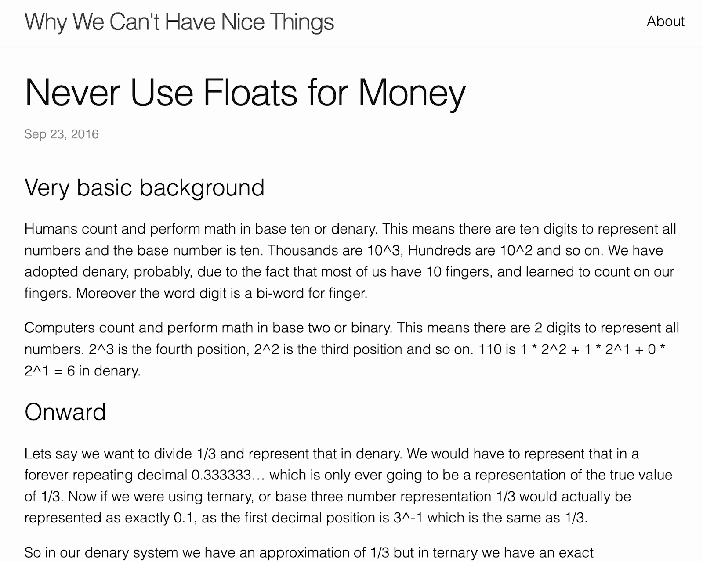

So they learn that it is very dangerous to represent currency as a float – much better to use the full value up to the cents as an integer, and then format it for the user later.  
But suddenly they remember a certain feature in the Animal Shelter Management System… _uh oh_!

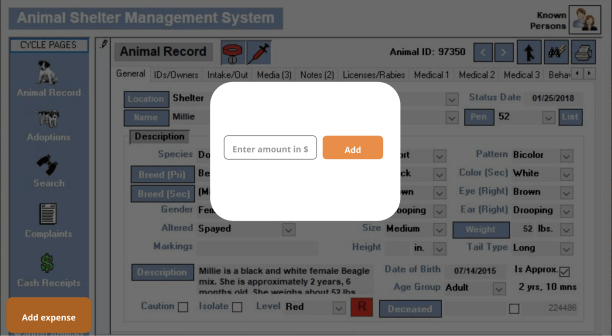

This is a feature that allows the shelter volunteers to record an expense for the animal’s food so they can keep track of their costs. It looks like a prime candidate for the Money Mistake™.

Upon closer inspection of the code, their fears are confirmed: the upper 2 layers of the application indeed use floats to represent monetary values.

## Current State

Here’s how the application looks like now.

**Frontend**

The frontend has a button that triggers an `addExpense()` function. Inside we can find the dreaded `parseFloat()`, which is used to parse the monetary value from the user input. The value is then sent to the backend with a POST to create the expense.


```js
const addExpense = () => {
  const rawAmount = document
    .getElementById("expense-input")
    .value
  const amount = parseFloat(rawAmount)
    
  fetch(`https://my-service-api/animal/${animalId}/expense`,
   { 
     method: 'POST', 
     body: { amount: amount } 
   })
  .then(success())
  .catch(error())
}
```

```html
<!-- button -->
<button class="expense-modal-open">
   Add Expense
</button>

<!-- modal -->

<div id="expense-modal">
  <input 
    type="text" 
    id="expense-input"
    placeholder="Enter amount in $"
  >
  <button onclick="addExpense()">
    Add expense
  </button>
</div>
```

**Backend**

The backend endpoint reads the value as a float from the payload, and passes it around as a float in all of its classes. Thankfully it converts it to integer before persisting it: the amount gets multiplied by 100 inside the `toIntCents` function (as it should always be) so that it can save it as cents.


```java
@RestController
class AnimalController {

   @PostMapping("/animals/{id}/expense")
   Expense newExpense(
        @PathVariable Long animalId,
        @RequestBody ExpensePayload newExpense
        ) {
     return repository.save(newExpense, animalId);
   }
 
}

class ExpensePayload {
  private Float amount;
}

class AnimalRepository {

    public Expense save(
      ExpensePayload payload, 
      String animalId) {
        // ...
        ResultSet resultSet = statement.executeQuery(
        "INSERT INTO expenses (animal_id, amount) VALUES " +
        "(...,
          " + toIntCents(amount) + "
        )"
        )
        return toExpense(resultSet);
    }
  
}

private Integer toIntCents(Float amount) {
    return amount * 100;
}
```

**Persistence**  
Finally, our persistence stores the amount in cents as a `bigint` type.


```
Table "public.expenses"

Column    |            Type             | 
--------------+-----------------------------+
expense_id   | integer                     |
identifier   | uuid                        |
animal_id    | integer                     |
created_date | timestamp                   |
amount       | bigint                      |

Indexes:
"expenses_pkey" PRIMARY KEY, btree (expense_id)
Foreign-key constraints:
"expenses_animal_id_fkey" FOREIGN KEY 
  (animal_id) REFERENCES animals(animal_id)
```

We want to refactor our application so that all layers (not just the persistence) handle the amount as an integer that represents the cents value.

In the next section, we will see the target state o the system.

## Target State

**Frontend**  
Our goal is for the frontend to immediately parse the value inputted by the user as cents (multiplying by 100), and pass it to the API.


```js
const addExpense = () => {
 const rawAmount = document
   .getElementById("expense-input")
   .value
 const amountInCents = parseInt(rawAmount.replace('.', ''))
   
 fetch(`https://my-service-api/animal/${animalId}/expense`,
  { 
    method: 'POST', 
    body: { amount: amountInCents } 
  })
 .then(success())
 .catch(error())
}
```

```html
<!-- button -->
<button class="expense-modal-open">
   Add Expense
</button>

<!-- modal -->

<div id="expense-modal">
  <input 
    type="text" 
    id="expense-input"
    placeholder="Enter amount in $"
  >
  <button onclick="addExpense()">
    Add expense
  </button>
</div>
```

**Backend**

The backend should read the correct value from the payload save it to the persistence as it is, without needing to modify it (it’s already in the correct format).


```java
@RestController
class AnimalController {

   @PostMapping("/animals/{id}/expense")
   Expense newExpense(
        @PathVariable Long animalId,
        @RequestBody ExpensePayload newExpense
        ) {
     return repository.save(newExpense, animalId);
   }
 
}

class ExpensePayload {
  private Integer amountInCents; 
}

class AnimalRepository {

    public Expense save(
      ExpensePayload payload, 
      String animalId) {
        // ...
        ResultSet resultSet = statement.executeQuery(
        "INSERT INTO expenses (animal_id, amount) VALUES " +
        "(...,
          " + amountInCents + "
        )"
        )
        return toExpense(resultSet);
    }
  
}
```

## How do we get there without breaking production?

This is different from our last example, as there is no _new_ feature to be kept hidden from the users – instead, the feature is already live (and there are no new interfaces to discover as all the code is well known). So, feature toggles are probably not the right approach here, as most of their benefits are diminished while their overhead remains.  
We can then take a step back and ask ourselves if there is an order in which we can release our changes to not break anything.

Releasing the frontend code first will result in errors from the backend, which is still expecting to be called with floats.

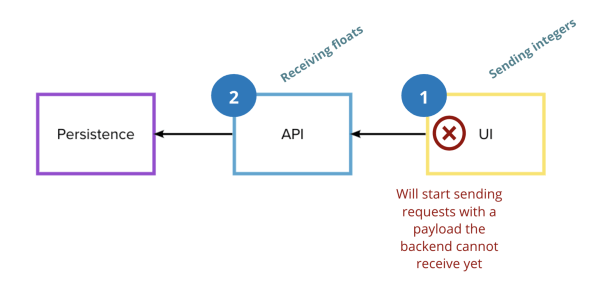

But releasing the backend code first will also end up similarly, with the frontend still sending the old now, incompatible format.

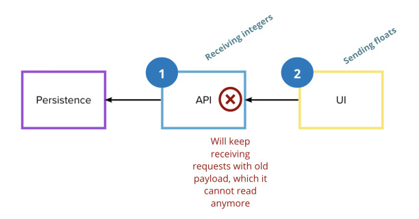

Whichever order we choose, it is clear that the functionality will be broken in front of the users for some time unless we take special precautions to avoid that.

## Expand and Contract (or Parallel Change)

Expand and contract is a technique that allows changing the shape of a contract while preserving functionality, without even temporary feature degradation.  
It is frequently mentioned in the context of code level refactoring (changing between classes), but it works even better in the context of distributed systems depending on each other.  
It consists of three steps:

-   **Expand phase**: in this phase we create the new logic in the producer systems under a separate interface that their consumers can use, without removing or breaking the old one.
-   **Migrate phase**: all consumers then are migrated across to use the new interface.
-   **Contract phase**: once all the consumers are using the new flow, the old one can finally be removed.

## Inside-Out

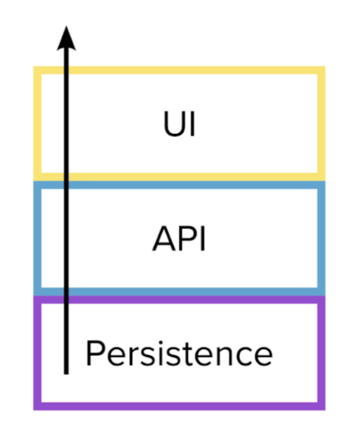

With the expand and contract approach, we have to start expansions with the producer systems and then migrate the consumers. This means we have to start with our innermost layers, working our way out to the ultimate client (UI code).  
  
Notice that this is the opposite of the direction we took in the previous section.

We can try to use this to resolve the dependencies in our money example.

## Implementing with Expand and Contract

We can proceed by starting with the system that needs to be expanded: our backend (the producer).

**Step 1: Expand phase**  
We can make the backend work entirely with integers, as long as the interface supports both integers and floats. In our case, we can have the controller try to guess if the client is sending a float amount and if so it should convert it to cents. If it is already in cents, it can do nothing.

  
(In some other cases with HTTP APIs, supporting two interfaces in the same endpoint becomes so complex that it’s easier to just make a different endpoint, but we won’t do it for our example).


```java
@RestController
class AnimalController {

   @PostMapping("/animals/{id}/expense")
   Expense newExpense(
        @PathVariable Long animalId,
        @RequestBody ExpensePayload newExpense
        ) {
         String rawAmount = body.get("amount");
         ExpensePayload newExpense = isFloatFormat(rawAmount) 
            ? new ExpensePayload(toIntCents(rawAmount))
            : new ExpensePayload(rawAmount)
         return repository.save(newExpense, animalId);
       }

   }
 
}

class ExpensePayload {
  private Integer amountInCents; 
}

class AnimalRepository {

    public Expense save(
      ExpensePayload payload, 
      String animalId) {
        // ...
        ResultSet resultSet = statement.executeQuery(
        "INSERT INTO expenses (animal_id, amount) VALUES " +
        "(...,
          " + amountInCents + "
        )"
        )
        return toExpense(resultSet);
    }
  
}
```

**Step 2: Migrate phase**  
The front end can now be changed to its target state, where it sends cents instead of floats. This makes the old flow unused on the API side.


```js
const addExpense = () => {
 const rawAmount = document
   .getElementById("expense-input")
   .value
 const amountInCents = parseInt(rawAmount.replace('.', ''))
   
 fetch(`https://my-service-api/animal/${animalId}/expense`,
  { 
    method: 'POST', 
    body: { amount: amountInCents } 
  })
 .then(success())
 .catch(error())
}
```

```html
<!-- button -->
<button class="expense-modal-open">
   Add Expense
</button>

<!-- modal -->

<div id="expense-modal">
  <input 
    type="text" 
    id="expense-input"
    placeholder="Enter amount in $"
  >
  <button onclick="addExpense()">
    Add expense
  </button>
</div>
```

**Step 3: Cleanup phase**  
Once the frontend code is migrated, we can remove the old flow and boilerplate code from the API, which is reaching its target state as well.


```java
@RestController
class AnimalController {

   @PostMapping("/animals/{id}/expense")
   Expense newExpense(
        @PathVariable Long animalId,
        @RequestBody ExpensePayload newExpense
        ) {
     return repository.save(newExpense, animalId);
   }
 
}

class ExpensePayload {
  private Integer amountInCents; 
}

class AnimalRepository {

    public Expense save(
      ExpensePayload payload, 
      String animalId) {
        // ...
        ResultSet resultSet = statement.executeQuery(
        "INSERT INTO expenses (animal_id, amount) VALUES " +
        "(...,
          " + amountInCents + "
        )"
        )
        return toExpense(resultSet);
    }
  
}
```

## Summary

Existing features should be refactored with the expand and contract pattern, approaching from the inside out. This is an alternative to having to use feature toggles for day to day refactoring, which are costly and require clean up.  
Of course, there might be some rare exceptions where the refactoring we are performing is especially risky, and we would like to still use a toggle to be able to switch the new flow off immediately, independent of deployment.  
Such situations however should not be the norm, and the team should question whether it is possible to take smaller steps whenever they arise.  
  
This example was focusing specifically on the contract between frontend and backend within our system, but the same pattern can be applied between any two distributed systems that need to alter the shape of their contract (and with synchronous _and_ asynchronous communication).

Special precautions should be taken however when the exclusive job of one of those systems is to persist state, as we will see in the next section.  
  
You can read more about the expand and contract pattern here: [https://martinfowler.com/bliki/ParallelChange.html](https://martinfowler.com/bliki/ParallelChange.html)

# Data and data loss

The attentive reader might have noticed what a lucky coincidence it was that the persistence layer was missing from our previous example, and how tricky it could have been to deal with. But programmers in the wild are seldom that lucky. That layer was conveniently left out as it deserves its own section: we will now address the heart of that trickiness and see how to refactor the database layer without any data loss.

First, let’s explore how the target state would look like in the same money example, but this time with all 3 layers suffering from the issue.

## Current State

**Frontend**  
The frontend doesn’t change: it’s sending floats just like before.

**Backend**  
This time the backend does not convert the float amount to cents before persisting it, as the database schema requires floats too now.


```java
@RestController
class AnimalController {

   @PostMapping("/animals/{id}/expense")
   Expense newExpense(
        @PathVariable Long animalId,
        @RequestBody ExpensePayload newExpense
        ) {
     return repository.save(newExpense, animalId);
   }
 
}

class ExpensePayload {
  private Float amount;
}

class AnimalRepository {

    public Expense save(
      ExpensePayload payload, 
      String animalId) {
        // ...
        ResultSet resultSet = statement.executeQuery(
        "INSERT INTO expenses (animal_id, amount) VALUES " +
        "(...,
          " amount + "
        )"
        )
        return toExpense(resultSet);
    }
  
}
```

**Persistence**  
And here is the database table with the incorrect `decimal` datatype.


```
Table "public.expenses"

Column    |            Type             | 
--------------+-----------------------------+
expense_id   | integer                     |
identifier   | uuid                        |
animal_id    | integer                     |
created_date | timestamp                   |
amount       | decimal                     |

Indexes:
"expenses_pkey" PRIMARY KEY, btree (expense_id)
Foreign-key constraints:
"expenses_animal_id_fkey" FOREIGN KEY 
 (animal_id) REFERENCES animals(animal_id)
```

Again, let’s see what is the final state we imagine for the system once the problem is solved in all the layers.

## Target state

  
**Backend**  
This time our target state will be what we started from in the last example: the backend converting and persisting the expense amount as cents (even if it is not receiving cents from the frontend yet).


```java
@RestController
class AnimalController {

   @PostMapping("/animals/{id}/expense")
   Expense newExpense(
        @PathVariable Long animalId,
        @RequestBody ExpensePayload newExpense
        ) {
     return repository.save(newExpense, animalId);
   }
 
}

class ExpensePayload {
  private Float amount;
}

class AnimalRepository {

    public Expense save(
      ExpensePayload payload, 
      String animalId) {
        // ...
        ResultSet resultSet = statement.executeQuery(
        "INSERT INTO expenses (animal_id, amount) VALUES " +
        "(...,
          " + toIntCents(amount) + "
        )"
        )
        return toExpense(resultSet);
    }
  
}
```

**Persistence**  
Similarly, the target state of the persistence layer will be what we could take for granted in the last example: currency being stored as a `bigint` type. We will need a database evolution to convert the type of the column and the existing data (multiply by 100 to obtain cents value).


```sql
ALTER TABLE expenses
ALTER COLUMN amount TYPE bigint 
USING (amount * 100)::bigint;
```

```
Table "public.expenses"

Column    |            Type             | 
--------------+-----------------------------+
expense_id   | integer                     |
identifier   | uuid                        |
animal_id    | integer                     |
created_date | timestamp                   |
amount       | bigint                      |

Indexes:
"expenses_pkey" PRIMARY KEY, btree (expense_id)
Foreign-key constraints:
"expenses_animal_id_fkey" FOREIGN KEY 
  (animal_id) REFERENCES animals(animal_id)
```

  

## How do we get there without breaking production?

**One change per repository?**

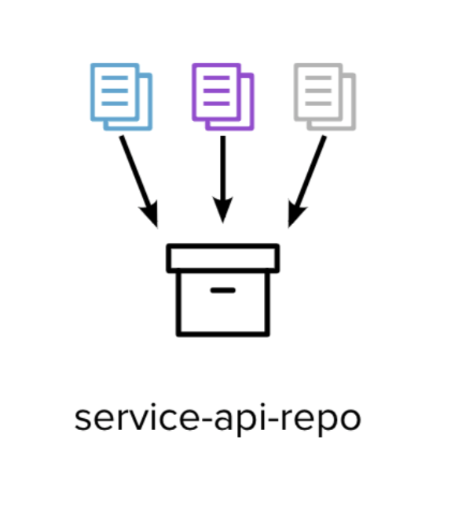

On many occasions, I have seen the persistence code being kept in the same source control repository as the backend code. Our example is no exception.

With such a setup, it might be tempting to add the database evolution and create the backend code that relies on the new schema shape in the same commit.

  
However, just because two changes live in the same repo doesn’t mean that they don’t affect different components. And it doesn’t mean they will be released simultaneously. In any given pipeline, the database changes will be deployed in a separate step than the application code.

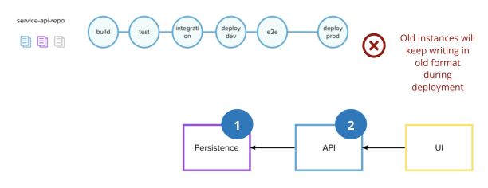

If the database evolutions are applied first, for example, our application will still attempt to save the old format in the database until the new version of it is deployed. This will lead to a brief period of failed requests, and data loss.  

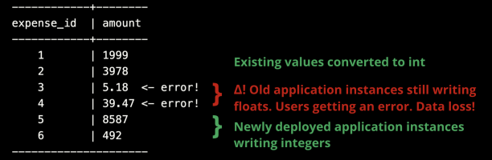

The same is true when the deployments happen in the opposite order. Therefore, we can conclude that we should isolate changes belonging to different distributed components in separate releases, even though their codebases might be versioned together.

**Can we apply expand and contract?**

It might also be tempting to simply try and apply the expand and contract pattern from the last section (we are dealing with refactoring an existing functionality, after all). We could imagine the expand and contract phases to look something like this:

-   **Expand phase:** expand our schema by creating another column `amount_cents`. Copy and convert all existing data to it. Old clients still write to old column `amount` and will need to be migrated
-   **Migration phase:** migrate all clients to write to new column `amount_cents`
-   **Contract phase:** finally remove the old column `amount`

However, this will also cause a data loss: nothing is being written to the new column between the expand and contract phases.

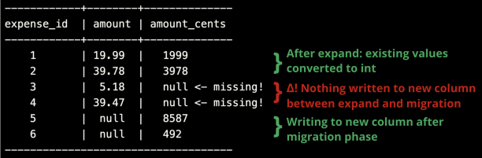

As we can see in the picture, there will be a gap in our new column in between the phases. The application will start using it and potentially return empty results or exceptions when retrieving data from that time window.

**How can we avoid data loss then?**

In the book “Refactoring Databases”, Scott J Ambler and Pramod J. Sadalage suggest relying on a database trigger to prevent this sort of scenario.

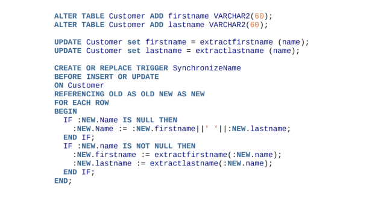

This would indeed start synchronizing old and new columns from the moment the new column is born. However, if like this author you’re not exactly thrilled to be implementing important logic in SQL (and just generally shiver at the thought of database triggers), you might find the next section more interesting…

## Pre-Emptive Double Write

We can make a little addition to our existing expand and contract pattern: before starting, we can change the application to attempt to write to both columns.

The column `amount_cents` will not exist yet, but we will code the application in a way that tolerates a failure when writing to it. Then we can proceed with the steps we had originally planned:

-   **Expand phase:** expand our schema by creating another column `amount_cents`. Copy and convert all existing data to it. Old clients still write to old column `amount` and will need to be migrated
-   **Migration phase:** migrate all clients to write to new column `amount_cents`
-   **Contract phase:** finally remove the old column `amount`

This will ensure that the very second the amount\_cents is created, data will start successfully being written to it, removing the gap we have observed in the previous section.

## Implementing with Pre-Emptive Double Write

**Step 1: Double Write**  
We first need to change the backend so that it will try to persist in both formats. Notice the try/catch block around the attempt to write to our new column, as we need to tolerate it not existing yet.


```java
class AnimalRepository {

  public Expense save(
    ExpensePayload payload, 
    String animalId) {
      // ...
      ResultSet resultSet = statement.executeQuery(
        "INSERT INTO expenses (animal_id, amount) VALUES " +
        "(...,
          " + amount + "
        )");

      try {
        resultSet = statement.executeQuery(
        "INSERT INTO expenses (animal_id, amount_cents) VALUES " +
        "(...,
          " + Math.round(amount * 100) + "
        )");
      } catch (Exception e) {
        // tolerate failure
      }

      return toExpense(resultSet);
  }

}
```

**Step 2: Expand**  
We can now create the new column and copy all the existing data to it with a database evolution. As soon as this runs, the column will start being populated with new data by the code above (without any gap).


```sql
ALTER TABLE expenses
ADD COLUMN amount_cents TYPE bigint;

ALTER TABLE expenses
SET amount_cents = (amount * 100)::bigint;
```

```
Table "public.expenses"

Column    |            Type             | 
--------------+-----------------------------+
expense_id   | integer                     |
identifier   | uuid                        |
animal_id    | integer                     |
created_date | timestamp                   |
amount       | decimal                     |
amount_cents | bigint                      |

Indexes:
"expenses_pkey" PRIMARY KEY, btree (expense_id)
Foreign-key constraints:
"expenses_animal_id_fkey" FOREIGN KEY 
  (animal_id) REFERENCES animals(animal_id)
```

**Step 3: Migrate**  
We can now migrate the backend to write and read from the new column. (And remove the now redundant try/catch too).


```java
class AnimalRepository {

  public Expense save(
    ExpensePayload payload, 
    String animalId) {
     // ...
     resultSet = statement.executeQuery(
     "INSERT INTO expenses (animal_id, amount_cents) VALUES " +
     "(...,
       " + Math.round(amount * 100) + "
     )");
     return toExpense(resultSet);
  }

}
```

**Step 4: Contract**  
We can add another database evolution to get rid of the old column, finally reaching our target state for both the persistence and the backend.


```sql
ALTER TABLE expenses
DROP COLUMN amount;
```

```
Table "public.expenses"

Column    |            Type             | 
--------------+-----------------------------+
expense_id   | integer                     |
identifier   | uuid                        |
animal_id    | integer                     |
created_date | timestamp                   |
amount_cents | bigint                      |

Indexes:
"expenses_pkey" PRIMARY KEY, btree (expense_id)
Foreign-key constraints:
"expenses_animal_id_fkey" FOREIGN KEY 
  (animal_id) REFERENCES animals(animal_id)
```

Notice that now we are in the same situation we were in with our previous example: the contract between backend and persistence is based on cents (integers), but the one between frontend and backend is still based on floats.  
We can go back to the “Refactoring” section and apply expand and contract between backend and frontend if we want to complete the fix.

## Summary

We can safely apply expand and contract when the database is involved by using the double write technique.  
In the money example, we reached the target state without causing any data loss or dropped transactions. However, _four_ releases were necessary to achieve this. This is an example of the overhead given by CD.  

However, not all applications have this requirement. It is important to check with the stakeholders if and when data loss is acceptable based on the nature of our software.

### A note on NoSQL databases

Just because the database management system doesn’t enforce a strict schema on the data it doesn’t mean that applications don’t rely on the objects they retrieve being a certain shape.  

Even if you are using MongoDB, Redis, DynamoDB, or just files… all of the steps above can apply. You should always be careful of what your code expects of any state which is stored in the outside world.  
Migrating it however might be a little more tricky than our example with SQL.

# Bringing it all together: making a Story Plan

We have seen how we might approach any given task in a Continuously Deployed system depending on the nature of the change:

-   approaching from the outside in when implementing a new feature (making sure to hide our work in progress with a feature toggle)
-   approaching from the inside out when altering already live functionality (applying expand and contract to respect each contract, and taking special care about data loss)

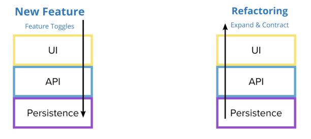

But in the real world, things are not so clear cut, and sometimes a task can be a bit of a mess of adding something new and changing something existing.

Let’s imagine the following user story for our last example:

* * *

`**As an** animal shelter volunteer`

`**I want to** be able to specify which type of expense I am recording`

`**So that** I can build more accurate expense reports`

* * *

Which would require adding a “type” dropdown in our well-known expense functionality.

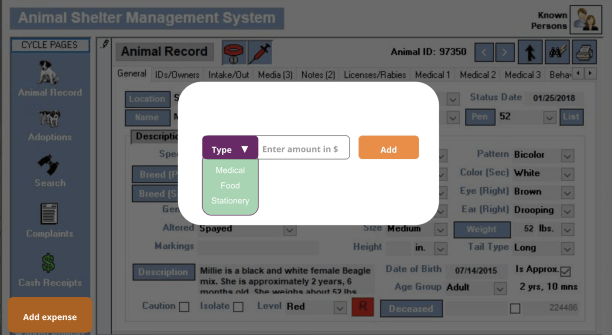

It definitely requires changing the shape of something existing: expenses will now have a type (the existing ones could have a default of “food”). But also it is a new functionality as it allows the user to specify _which type_, and there is definitely a visual change there that might need to be hidden.  
So which approach do we choose here? In which direction do we start?

## Pre-Refactoring the system

We can apply the practice of “preparatory refactoring” to get the system into a state where adding the feature becomes a trivial change.  

Whenever we get a task whose nature is mixed, or unclear, we could approach it by grouping all the changes which do not have any visible effect on the user so we can address them at the beginning. We can use our expand and contract workflow (for example adding fields with default values, stretching existing abstractions…) with them, and leave the feature addition to the very end.  
  
This not only allows us to give ourselves a framework to work with, but it also reduces to the minimum the code that will end up under a feature toggle (and therefore the risk of release!).  
  
The totality of the steps and commits we plan to achieve this can constitute our Story Plan.

## Making a Story Plan

The final plan can be a diagram of which direction to follow, combined with a list of minimum code releases to safely follow the practices.

In our expenses types example, it might look something like this:

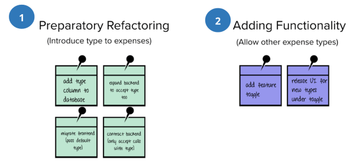

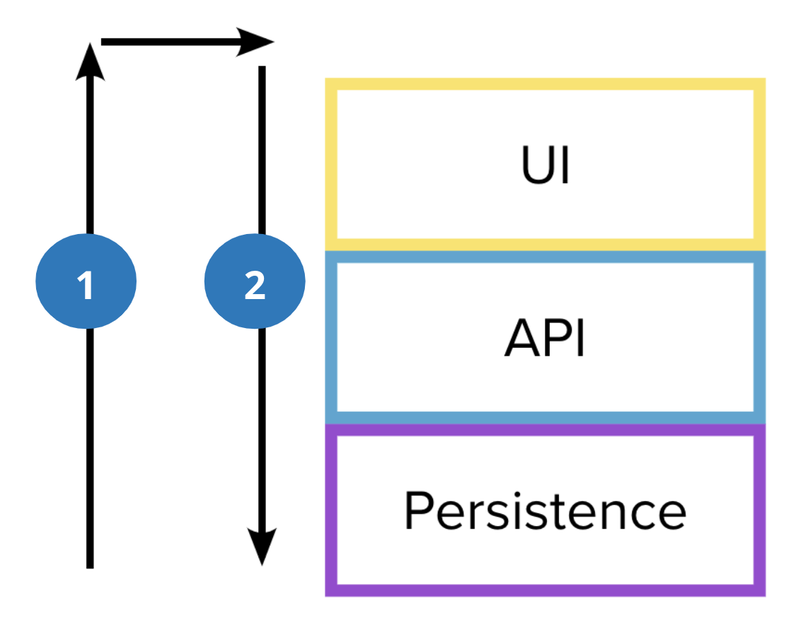

In the author’s experience, this should probably be very informal during development. A scribble on some post-it notes or a notebook would probably suffice. The purpose of this exercise would be to put ourselves in the good habit of taking dependencies explicitly into consideration at the beginning of a task – without going headfirst on the code.

# Conclusions

With what we have talked about so far, we can summarize these four principles for practising Continuous Deployment safely:

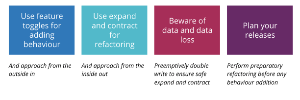

However, if I had to leave the reader with just one thought, it would be this: when every commit goes to production we cannot afford to not know what the impact of our code is going to be once there, at every step of its readiness lifecycle. Even the intermediate ones. Starting with an incomplete picture of the target status of the codebase(s) is not enough anymore: we must spend the time investigating or spiking out our changes to map out how we are sending them live. (Even without necessarily agreeing with all the ways of working described in this article.)

In short: as amazing and liberating as CD might be compared to older ways of working, they also force us to take ourselves and our peers accountable to an even higher standard of professionalism and deliberateness over the code and tests we are checking in. Our users are just always a few minutes away from the latest version of our code, after all.

I hope this guide can be useful to even a couple of people considering adopting Continuous Deployment (or struggling with it). Feel free to send feedback in the comment or through any other private channel.
