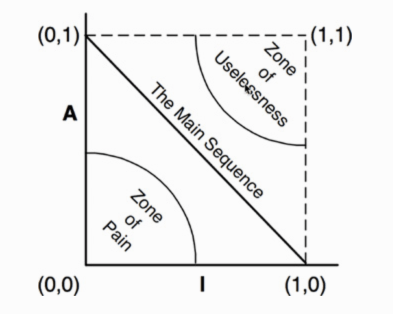
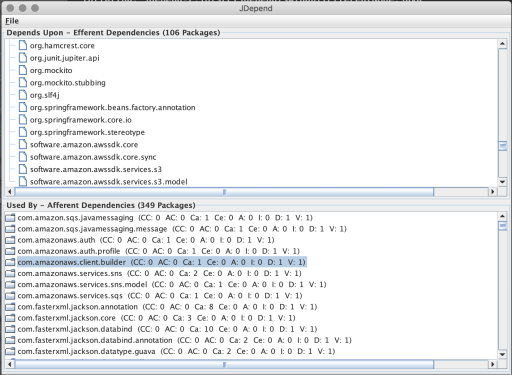
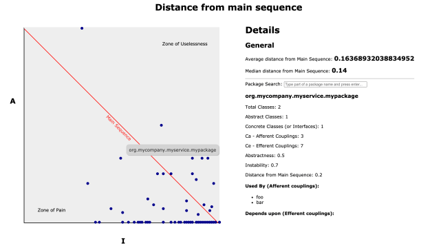

I must not have been the only one to read “Clean Architecture” by Uncle Bob (Robert Martin) and be immediately sold on the abstractness, instability, coupling and main sequence metrics.  
I must not have been the only one to immediately Google for tools to generate them for whichever codebase I happened to be working on at the moment, anxious to see if my refactoring instincts could be backed by a pretty diagram.  
And yet, based on the very disappointing (lack of) results, it seems like that might be the case.  
  
There are a few tools for the job yes, but they are clunky to run at best, and they definitely do not produce a visual output to quickly get insights from.

After hours of tinkering and getting a result, I thought I would share and write this guide for others like me who might have gone through the same experience. Hopefully it will spare some time to the next person.

Let’s begin!

### Step 1: Installing JDepend

Fortunately, most of the heavy lifting has already been made by the authors of this really nice tool: [https://github.com/clarkware/jdepend](https://github.com/clarkware/jdepend). It will allow us to generate a report of our packages dependencies in an XML format (which we’ll need for our visualization).  
From the documentation:

> JDepend traverses Java class and source file directories and generates design quality metrics for each Java package. JDepend allows you to automatically measure the quality of a design in terms of its extensibility, reusability, and maintainability to effectively manage and control package dependencies.
> 
> From the JDepend README.

Unfortunately, there is not much more information than this in the main README file. Proper installation instructions are a bit buried (you would need to download the repo and then open the html doc files in some browser… ugh) and they are a bit complicated. I’ll list them here so you don’t have to look for them.

First, we want to make a folder which is going to be our workspace for using JDepend and open it with our terminal.

Then, we want to download the latest major release as a zip file (the url points to the zip in the `dist` folder of the repo):

```shell
$ wget -O jdepend-2.10.zip https://github.com/clarkware/jdepend/blob/master/dist/jdepend-2.10.zip\?raw\=true
```

Then unzip the file

```shell
$ unzip jdepend-2.10.zip
```

Set the unzipped directory as our `$JDEPEND_HOME`.

```shell
$ export JDEPEND_HOME="$(pwd)/jdepend-2.10"
```

Finally we will need to change the file permissions

```shell
$ chmod -R a+x $JDEPEND_HOME
```

And add the jar file in the unzipped folder to our classpath:

```shell
$ export CLASSPATH=$CLASSPATH:$JDEPEND_HOME/lib/jdepend-2.10.jar
```

Congrats! JDepend is now ready to be used. (Yes, this was the simplified version).

### Step 2: Generating the XML report

On the documentation we see that

> JDepend provides a graphical, textual, and XML user interface to visualize Java package metrics, dependencies, and cycles.

However, if we take a look at the graphical interface we realise that it is a bit… old fashioned.



And it’s very far from the beautiful diagrams we imagined by reading at the Clean Architecture anyway.

The textual interface also doesn’t help much:

```
--------------------------------------------------
- Summary:
--------------------------------------------------

Name, Class Count, Abstract Class Count, Ca, Ce, A, I, D, V:
org.springframework.jms.annotation,0,0,1,0,0,0,1,1
org.springframework.jms.config,0,0,1,0,0,0,1,1
org.springframework.security.access.prepost,0,0,4,0,0,0,1,1
org.springframework.stereotype,0,0,56,0,0,0,1,1
org.springframework.test.annotation,0,0,1,0,0,0,1,1
org.springframework.test.context,0,0,3,0,0,0,1,1
...
```

But fortunately, JDepend also offers the possibility to get the output in XML format, so that we can use it to generate any other kind of visualisation we like.  
That is exactly what we are going to do with this command:

```shell
$ java jdepend.xmlui.JDepend -file report.xml <path-to-the-root-of-your-java-project>/build
```

Which should produce a `report.xml` file. We’ll see how to produce the visualization in the next section.

### Step 3: Installing JDepend-UI

[jdepend-ui](https://github.com/ValentinaServile/jdepend-ui) is a little JavaScript based tool I hacked together to transform the XML report into a somewhat useful html page with some insights, that can be more easily navigated than the old JDepend interfaces.

All you need to do to install it is to clone the repo

```shell
$ git clone git@github.com:ValentinaServile/jdepend-ui.git
```

Make sure you have `node` and `npm` installed, and run:

```shell
$ cd jdepend-ui && npm install
```

### Step 4: Generating the final report

Now that you have jdepend-ui installed, we can use it to generate a much nicer HTML visualization.

We can do that by running the command

```
npm run jdepend-ui <path-to-xml-report-file> <your-packages-prefix>
```

Where the path to your XML report should be `../report.xml` at this point (if you have followed all the steps in this guide to the letter).

Your package prefix is something like “com.yourcompany.yourservice”. The tool will use it to filter out the metrics that belong to external packages so that you only see the ones which you actually wrote.

If everything went okay, you should now have an `index.html` file in your working directory.  
If you open it with a web browser, you should see something like:



In the page you can see the same graph as we saw in Clean Architecture generated from the JDepend metrics. Every “dot” on the screen represents one of your packages. There is a “general” section which has average and median distance from the main sequence scores for the entire codebase.

If you click on any of the dots, the package specific details on the right side of the screen will appear: they contain the package name, couplings count, abstractness and instability scores, its distance from the main sequence and finally a list of which other packages use it and which other packages it uses.

You can also search for a package by name with the search bar.
