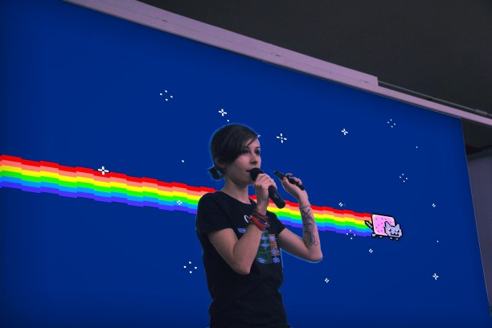

Valentina Servile  
Principal Software Developer @ ThoughtWorks

## Hi – this is my blog

My name is Valentina and I am a wannabe software craftsperson.

I like to write clean code and ramble about things I don’t fully understand.

## I wrote a book

[**Continuous Deployment**](https://www.oreilly.com/library/view/continuous-deployment/9781098146719/) —
*Enable Faster Feedback, Safer Releases, and More Reliable Software* (O’Reilly, 2024),
with a foreword by Dave Farley.

It is about what changes when every commit goes straight to production and there is no
manual gate left to hide behind: how to break work into increments that can ship
half-finished without anyone noticing, and what that demands of your tests, your
observability, and the way a team plans its day. It draws on years of doing this with
teams at Thoughtworks, plus interviews and case studies from people who have lived it.

If you want a taste of the subject first, this blog’s
[Surviving Continuous Deployment in Distributed Systems](/blog/surviving-continuous-deployment-in-distributed-systems/)
covers some of the same ground.

## Elsewhere

-   [GitHub](https://github.com/ValentinaServile)
-   [LinkedIn](https://www.linkedin.com/in/valentina-servile/)

## Contact me

valentina.servile[at]gmail.com
